<p align="center">
    <a href="https://www.kotlinorm.com">
        
    </a>
</p>

---------

<h1 align="center">
    Kronos-ORM
</h1>

[English](https://github.com/Kronos-orm/Kronos-orm/blob/main/README.MD) | 简体中文

<h3 align="center">
为 Kotlin 设计的现代 ORM 框架。
</h3>
<div align="center">

Kronos 是基于编译器插件的 Kotlin ORM 框架。零反射、强类型、多数据库支持，适用于服务端和移动端应用。

[](http://kotlinlang.org)
[](https://github.com/Heapy/awesome-kotlin)
[](https://www.apache.org/licenses/LICENSE-2.0.html)

[](https://app.codacy.com/gh/Kronos-orm/Kronos-orm/dashboard?utm_source=gh&utm_medium=referral&utm_content=&utm_campaign=Badge_grade)
[](https://coverage.kotlinorm.com/kronos-compiler-plugin)
[](https://coverage.kotlinorm.com/kronos-core)
[](https://coverage.kotlinorm.com/kronos-syntax)
[](https://coverage.kotlinorm.com/kronos-codegen)

[](https://github.com/kronos-orm/kronos-orm/actions/workflows/detekt.yml)
[](https://github.com/kronos-orm/kronos-orm/actions/workflows/kronos-core-testing.yml)
[](https://github.com/kronos-orm/kronos-orm/actions/workflows/kronos-syntax-testing.yml)
[](https://github.com/kronos-orm/kronos-orm/actions/workflows/kronos-compiler-plugin-testing.yml)
[](https://github.com/kronos-orm/kronos-orm/actions/workflows/kronos-codegen-testing.yml)
[](https://github.com/kronos-orm/kronos-orm/actions/workflows/kronos-testing.yml)

[](https://search.maven.org/search?q=g:com.kotlinorm)
[](https://central.sonatype.com/service/rest/repository/browse/maven-snapshots/com/kotlinorm/)

[官网](https://www.kotlinorm.com) | [中文文档](https://kotlinorm.com/#/documentation/zh-CN/getting-started/quick-start) | [Discord](https://discord.gg/Vn8EzxRX) | [QQ群](https://qm.qq.com/q/V821JzFUcM)
</div>

<p align="center">
  <a href="https://github.com/Kronos-orm/Kronos-orm/stargazers">
    
  </a>
</p>

--------

## 为什么选择 Kronos

- **零反射** — 编译器插件在构建期生成所有映射代码，无运行时开销，无 GC 压力。
- **Kotlin 原生 DSL** — 直接使用 `==`、`>`、`<`、`in`、`like` 编写条件，无需 `.eq()`、`.gt()`、`.lt()`。
- **多数据库** — 内置 MySQL、PostgreSQL、SQLite、SQL Server、Oracle 方言。
- **功能完备** — 事务、级联（1:1 / 1:N / M:N）、表结构同步、序列化、跨库查询。
- **内置策略** — 逻辑删除、乐观锁、创建/更新时间戳，均可自定义。
- **框架无关** — Spring Boot、Ktor、Vert.x、Solon、Android，轻易集成。
- **协程友好** — 从底层为结构化并发设计。
- **编译期映射** — KPojo 与 Map 互转，近乎零开销。
- **编译期类型投影** — `select`、`join`、`union` 都会暴露生成结果类型，字段和 alias 由 Kotlin 在编译期检查。
- **可组合查询** — 投影类型可以贯穿派生子查询、标量与谓词子查询、INSERT SELECT、CTAS 和 Union 查询层。

## 贡献者指引

AI 编程助手可参考 `.agents/skills/` 下的技能指南获取架构与工作流上下文。

--------

## 快速示例

```kotlin
data class User(
    @PrimaryKey(identity = true) val id: Long? = null,
    val username: String? = null,
    val age: Int? = null
) : KPojo

dataSource.table.createTable<User>()

val id = User(username = "test", age = 18).insert().withId().execute().lastInsertId

val listOfUser = User().select().where { it.age == 18 }.toList()

User(id = id, age = 19).update().by { it.id }.execute()

User(id = id).delete().by { it.id }.execute()
```

## 投影与子查询示例

Kronos 为 Kotlin 查询加入了编译期生成投影类型，选出的 alias 可以被下一层查询继续消费。

```kotlin
val rankedOrders = Order()
    .select {
        [
            it.id,
            it.userId,
            it.amount,
            f.rowNumber()
                .over {
                    partitionBy(it.userId)
                    orderBy(it.createTime.desc())
                }
                .alias("rn")
        ]
    }
// 投影：{ id: Int?, userId: Int?, amount: BigDecimal?, rn: Long? }

val latestOrders = rankedOrders
    .select { [it.id, it.userId, it.amount] }
    .where { it.rn == 1 }
    .toList()
// 结果：List<{ id: Int?, userId: Int?, amount: BigDecimal? }>

val orderCounts = Order()
    .select { [it.userId, f.count(it.id).alias("orderCount")] }
    .groupBy { it.userId }
// 投影：{ userId: Int?, orderCount: Long? }

orderCounts
    .insert<UserOrderSummary> { [it.userId, it.orderCount] }
    .execute()

val activeUsers = User()
    .select { [it.id, it.name, it.status] }
    .where { it.status == ACTIVE }
// 投影：{ id: Long?, name: String?, status: Int? }

dataSource.table.createTable(UserArchive(), activeUsers)

val currentUsers = User().select { [it.id, it.name] }.where { it.enabled == true }
// 投影：{ id: Long?, name: String? }

val archivedUsers = ArchivedUser().select { [it.id, it.name] }
// 投影：{ id: Long?, name: String? }

val users = union(currentUsers, archivedUsers)
    .select { [it.id, it.name] }
    .toList()
// 结果：List<{ id: Long?, name: String? }>
```

## 环境要求

| 依赖 | 版本 |
|------|------|
| JDK | 8+ |
| Kotlin | 2.4.0+ |
| Gradle | Kotlin 2.4.0 支持的版本 |
| Maven | 3.9+ |

> 请确保 IDE 的 Kotlin 插件支持 Kotlin 2.4.0 或更高版本。

## Kotlin 版本兼容性

| Kronos 版本 | 支持的 Kotlin 版本 | 说明 |
|-------------|--------------------|------|
| `0.2.4` | `2.4.0+` | 推荐版本，Kotlin 2.4.0 版本线的最新稳定补丁 |
| `0.2.3` | `2.4.0+` | 新增游标分页并修复派生投影 |
| `0.2.0` | `2.4.0+` | 包含查询、wrapper 和类型元数据 API 的破坏性变更 |
| `0.1.2` | `2.4.0+` | 修复表结构同步边缘场景并扩充跨数据库集成测试 |
| `0.1.1` | `2.4.0+` | 补充投影文档、IDEA 插件文档与发版自动化改进 |
| `0.1.0` | `2.3.0+` | 基于 Kotlin 2.3.0 的正式发布版本 |
| `0.0.7` | `2.3.0+` | 在 0.0.7 中升级 Gradle 和 Kotlin |
| `0.0.6` | `2.2.21+` | 添加 `kotlin.time.Instant` 支持 |
| `0.0.2` - `0.0.5` | `2.2.0+` | 2.2.21 升级前的早期开发版本 |
| `0.0.1` | `2.1.0+` | 初始公开发布版本线 |

--------

## 安装

<details>
<summary><b>Gradle (Kotlin DSL)</b></summary>

```kotlin
plugins {
    id("com.kotlinorm.kronos-gradle-plugin") version "0.2.4"
}

dependencies {
    implementation("com.kotlinorm:kronos-core:0.2.4")
    implementation("com.kotlinorm:kronos-jdbc-wrapper:0.2.4")
    implementation("com.mysql:mysql-connector-j:<latest-stable>")
}
```

</details>

<details>
<summary><b>Gradle (Groovy)</b></summary>

```groovy
plugins {
    id 'com.kotlinorm.kronos-gradle-plugin' version '0.2.4'
}

dependencies {
    implementation 'com.kotlinorm:kronos-core:0.2.4'
    implementation 'com.kotlinorm:kronos-jdbc-wrapper:0.2.4'
    implementation 'com.mysql:mysql-connector-j:<latest-stable>'
}
```

</details>

<details>
<summary><b>Maven</b></summary>

```xml
<project>
    <dependencies>
        <dependency>
            <groupId>com.kotlinorm</groupId>
            <artifactId>kronos-core</artifactId>
            <version>0.2.4</version>
        </dependency>
        <dependency>
            <groupId>com.kotlinorm</groupId>
            <artifactId>kronos-jdbc-wrapper</artifactId>
            <version>0.2.4</version>
        </dependency>
        <dependency>
            <groupId>com.mysql</groupId>
            <artifactId>mysql-connector-j</artifactId>
            <version>${mysql-connector-j.version}</version>
        </dependency>
    </dependencies>

    <build>
        <plugins>
            <plugin>
                <groupId>org.jetbrains.kotlin</groupId>
                <artifactId>kotlin-maven-plugin</artifactId>
                <extensions>true</extensions>
                <configuration>
                    <compilerPlugins>
                        <plugin>kronos-maven-plugin</plugin>
                    </compilerPlugins>
                </configuration>
                <dependencies>
                    <dependency>
                        <groupId>com.kotlinorm</groupId>
                        <artifactId>kronos-maven-plugin</artifactId>
                        <version>0.2.4</version>
                    </dependency>
                </dependencies>
            </plugin>
        </plugins>
    </build>
</project>
```

</details>

## 支持的数据库

MySQL | PostgreSQL | SQLite | SQL Server | Oracle

> Kronos 会根据当前数据库方言选择 SQL 渲染和表结构语句。

--------

## 使用

### 连接数据库

```kotlin
import com.kotlinorm.Kronos
import com.kotlinorm.wrappers.KronosJdbcWrapper

Kronos.dataSource = { KronosJdbcWrapper(SomeDataSource()) }
```

`KronosJdbcWrapper`也可以传入`databaseType = DBType.Mysql`，并通过配置block设置JDBC statement、warning处理、参数绑定和结果映射。动态数据源和多数据源配置请参阅[连接数据库](https://kotlinorm.com/#/documentation/zh-CN/database/connect-to-db)。

### 模型定义

```kotlin
@Table("tb_movie")
@TableIndex("idx_name", ["name"], "UNIQUE", "BTREE")
data class Movie(
    @PrimaryKey(identity = true)
    val id: Long? = null,
    @NonNull val name: String? = null,
    val directorId: Long? = null,
    @Cascade(["directorId"], ["id"])
    val director: Director? = null,
    val relations: List<MovieActorRelation>? = null,
    @Serialize
    val type: List<String>? = null,
    @Column("movie_summary")
    val summary: String? = null,
    @Version val version: Long? = null,
    @LogicDelete val deleted: Boolean? = null,
    @DateTimeFormat("yyyy-MM-dd HH:mm:ss")
    @UpdateTime val updateTime: String? = null,
    @CreateTime val createTime: LocalDateTime? = null
) : KPojo {
    var actors: List<Actor>? by manyToMany(::relations)
}
```

`@Serialize` 字段在序列化和反序列化时都会使用属性声明上的 `KType`，因此 `List<String>`、`List<List<String>>`、`List<Profile>` 等类型的泛型元素信息不会丢失。

```kotlin
import com.kotlinorm.Kronos
import com.kotlinorm.interfaces.KronosSerializeProcessor
import kotlinx.serialization.KSerializer
import kotlinx.serialization.json.Json
import kotlinx.serialization.serializer
import kotlin.reflect.KType

object KotlinxSerializeProcessor : KronosSerializeProcessor {
    private val json = Json {
        encodeDefaults = true
        ignoreUnknownKeys = true
    }

    override fun serialize(obj: Any, kType: KType): String {
        @Suppress("UNCHECKED_CAST")
        val valueSerializer = serializer(kType) as KSerializer<Any>
        return json.encodeToString(valueSerializer, obj)
    }

    override fun deserialize(serializedStr: String, kType: KType): Any =
        json.decodeFromString(serializer(kType), serializedStr)
            ?: error("Kotlinx serialization returned null for $kType")
}

Kronos.serializeProcessor = KotlinxSerializeProcessor
```

交给 Kotlinx Serialization 处理的 Kotlin data class 需要添加 `@kotlinx.serialization.Serializable`。完整 Gson 和 Kotlinx 示例见[序列化](https://kotlinorm.com/#/documentation/zh-CN/mapping/serialization)。

### 表操作

```kotlin
dataSource.table.exists<Movie>()
dataSource.table.createTable<Movie>()
dataSource.table.syncTable<Movie>()
dataSource.table.dropTable<Movie>()
```

### 查询

```kotlin
import com.kotlinorm.database.SqlExecutor.query

val users = User()
    .select { [it.id, it.username] }
    .where { it.id < 10 && it.age >= 18 }
    .distinct()
    .groupBy { it.id }
    .orderBy { it.username.desc() }
    .toList()
// 结果：List<{ id: Long?, username: String? }>

// 分页
val (total, list, totalPages) = User()
    .select { [it.id, it.username] }
    .where { it.id < 10 && it.username like "a%" }
    .withTotal()
    .page(1, 10)
    .toList()
// total: Int；list: List<{ id: Long?, username: String? }>；totalPages: Int

// 联表查询
val usersWithRoles = User().join(UserRelation(), UserRole()) { user, relation, role ->
    on { user.id == relation.userId && user.id == role.userId }
    select {
        [user.id, user.username, relation.id.alias("relationId"),
                role.role, f.count(1).alias("count")]
    }
    where { user.id < 10 }
}.toList()
// 结果：List<{ id: Long?, username: String?, relationId: Long?, role: String?, count: Long? }>

// Union
val currentUsers = User()
    .select { [it.id, it.username] }
    .where { it.enabled == true }
// 投影：{ id: Long?, username: String? }

val archivedUsers = ArchivedUser()
    .select { [it.id, it.username] }
// 投影：{ id: Long?, username: String? }

val allUsers = union(currentUsers, archivedUsers).toList()
// 结果：List<{ id: Long?, username: String? }>

// 命名参数原生 SQL
val result = dataSource.query("select * from tb_user where id = :id", mapOf("id" to 1))
```

### 插入

```kotlin
user.insert().execute()
listOfUser.insert().execute()
```

### 更新

```kotlin
user.update()
    .set {
        it.username = "123"
        it.score += 10
    }
    .by { it.id }
    .execute()

user.update { [it.username, it.gender] }
    .by { it.id }
    .execute()
```

### Upsert

```kotlin
user.upsert { it.username }
    .on { it.id }
    .execute()

user.upsert { it.username }
    .onConflict()
    .execute()
```

### 删除

```kotlin
user.delete()
    .where { it.id == 1 }
    .execute()
```

--------

### KPojo 工具方法

```kotlin
val instance = Movie::class.newInstance()

val dataMap: Map<String, Any?> = movie.toDataMap()
val movie2: Movie = dataMap.mapperTo<Movie>()

val tableName = movie.__tableName // 可读写
val tableComment = movie.__tableComment
val columns = movie.__columns
val indexes = movie.__tableIndexes
val createTime = movie.__createTime
val updateTime = movie.__updateTime
val logicDelete = movie.__logicDelete
val optimisticLock = movie.__optimisticLock

instance["fieldName"]
instance["fieldName"] = "value"
```

所有操作在编译期完成，无反射。

--------

## 框架集成

| 框架 | 示例 |
|------|------|
| Spring Boot | [kronos-example-spring-boot](https://github.com/Kronos-orm/kronos-example-spring-boot) |
| Ktor | [kronos-example-ktor](https://github.com/Kronos-orm/kronos-example-ktor) |
| Vert.x | [kronos-example-vertx](https://github.com/Kronos-orm/kronos-example-vertx) |
| Solon | [kronos-example-solon](https://github.com/Kronos-orm/kronos-example-solon) |
| Android | [kronos-example-android](https://github.com/Kronos-orm/kronos-example-android) |

## AI 编程助手集成

Kronos 提供 AI 技能指南，帮助编程助手理解和生成 Kronos 代码。可以直接从 `main` 分支安装 skill：

| 工具 | 命令 |
|------|------|
| **Claude** | `npx degit Kronos-orm/Kronos-orm/.agents/skills/kronos-orm-guide#main .claude/skills/kronos-orm-guide` |
| **Codex** | `npx degit Kronos-orm/Kronos-orm/.agents/skills/kronos-orm-guide#main .agents/skills/kronos-orm-guide` |
| **Cursor** | `npx degit Kronos-orm/Kronos-orm/.agents/skills/kronos-orm-guide#main .cursor/skills/kronos-orm-guide` |
| **默认 / 通用** | `npx degit Kronos-orm/Kronos-orm/.agents/skills/kronos-orm-guide#main .agents/skills/kronos-orm-guide` |

如果目标目录已存在，在 `degit` 后添加 `--force`。

Claude Code 从 `.claude/skills/` 读取项目 skill；Codex 从 `.agents/skills/` 读取项目 skill。Windsurf 和其他读取 `.agents/skills/` 的工具使用默认命令。

--------

## 文档

完整文档请访问[官方网站](https://www.kotlinorm.com)或[文档中心](https://kotlinorm.com/#/documentation/zh-CN/getting-started/quick-start)。

## 许可证

Kronos-ORM 遵循 [Apache 2.0 许可证](https://www.apache.org/licenses/LICENSE-2.0.html)发布。

## 贡献

参阅 [CONTRIBUTING.md](https://github.com/Kronos-orm/Kronos-orm/blob/main/CONTRIBUTING.md)。

## 贡献者

<a href="https://github.com/Kronos-orm/Kronos-orm/graphs/contributors">
  
</a>

-------------------

[](https://discord.gg/Vn8EzxRX)
[](https://qm.qq.com/q/V821JzFUcM)


