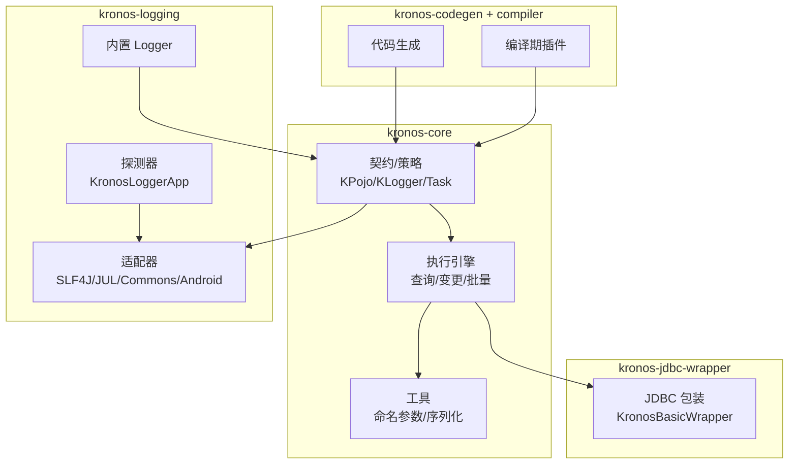
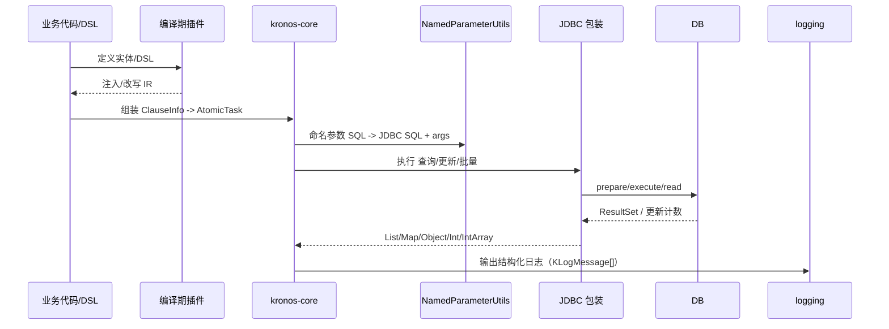

    

<h1 align="center">Kronos-ORM 开发者文档</h1>

<a href="./README.md">English</a> | 简体中文

 

 
<a href="https://www.kotlinorm.com">官网</a> | <a href="https://kotlinorm.com/#/documentation/zh-CN/getting-started/quick-start">中文文档</a>

---

本页为 develop-docs 的中文入口，帮助你建立整体心智模型并快速跳转到各模块的详细文档，同时附带多张示意图。

## 模块概览
- kronos-core：核心部分（注解、KPojo、任务、策略）、执行引擎、工具与内置日志工具；
- kronos-logging：日志适配器与自动探测，内置简单 Logger；日志 DSL 定义在 core；
- kronos-jdbc-wrapper：JDBC 生产可用的数据源包装实现；
- kronos-codegen：从数据库元数据生成 Kotlin 实体与注解；
- kronos-compiler-plugin：编译期增强与注入，实现 DSL 解析。

快速导航：
- 入门：[下载、构建与运行指南](getting-started-zh_CN.md)
- Core：[架构图](./kronos-core/sections/zh_CN/04-架构图.md)
- Logging：[README](./kronos-logging/README.md)
- JDBC Wrapper：[README](./kronos-jdbc-wrapper/README.md)
- Codegen：[README](./kronos-codegen/README.md)
- Compiler Plugin：[目录结构与关键类](./kronos-compiler/sections/zh_CN/02-目录结构与关键类.md)

重点章节直达：
- 日志 DSL 与设计：[kronos-logging/sections/zh-CN/04-dsl-and-design.md](./kronos-logging/sections/en/04-dsl-and-design.md)
- JDBC 用法示例：[kronos-jdbc-wrapper/sections/zh-CN/03-usage.md](./kronos-jdbc-wrapper/sections/en/03-usage.md)
- 核心架构与流程图：[kronos-core/sections/zh_CN/04-架构图.md](./kronos-core/sections/zh_CN/04-架构图.md)

### 顶层关系图

### 端到端流程（示意）

### 阅读建议
- 按需查阅：
  - 想接入日志：阅读 logging README 与 DSL 设计章节；
  - 想执行数据库：阅读 JDBC wrapper README 与用法；
  - 想从库生成实体：阅读 Codegen 指南；
  - 想理解运行机制：查看 core 中文架构与时序图；
  - 想扩展日志后端：参考 kronos-logging 适配器实现。
