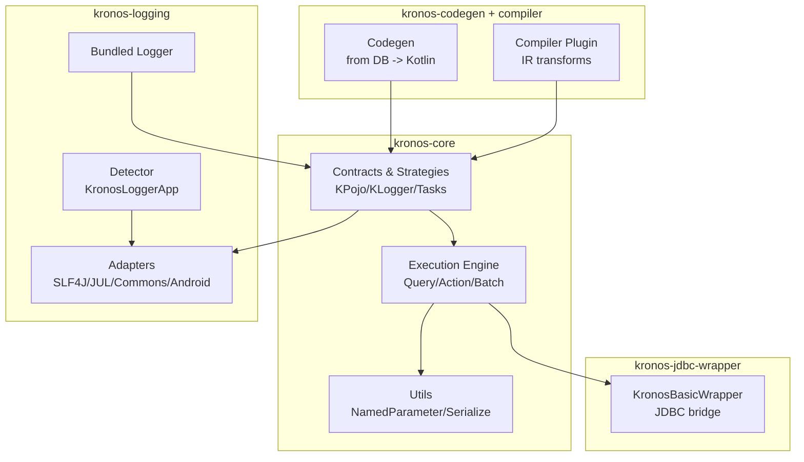
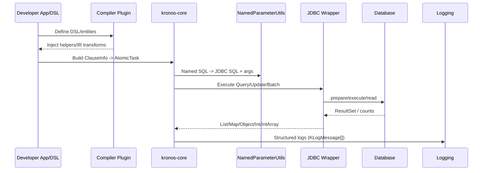

    

<h1 align="center">Kronos-ORM Developer Docs</h1>

English | <a href="./README-zh_CN.md">简体中文</a>

 

 
<a href="https://www.kotlinorm.com">Official Website</a> | <a href="https://kotlinorm.com/#/documentation/en/getting-started/quick-start">Documentation</a>

---

This page is the English entry to all developer documents under develop-docs. It explains how modules fit together, where to start, and links to detailed guides. Rich diagrams are included for a quick mental model.

## Overview
Kronos-ORM is composed of several modules working together:
- kronos-core: core contracts (KPojo, tasks, strategies), execution engine, utilities, and logging contract;
- kronos-logging: adapters to external logging systems + bundled logger; logging DSL is defined in core;
- kronos-jdbc-wrapper: production-ready JDBC implementation of KronosDataSourceWrapper;
- kronos-codegen: generate Kotlin entities and annotations from DB metadata;
- kronos-compiler-plugin: compile-time transforms and injections for DSL ergonomics.

Quick navigation:
- Getting started: [Download, Build and Run Guide](./getting-started.md)
- Core: [Architecture diagrams (EN)](./kronos-core/sections/en/04-Architecture.md) and other sections in the module
- Logging: [README](./kronos-logging/README.md), EN sections and zh_CN sections
- JDBC Wrapper: [README](./kronos-jdbc-wrapper/README.md)
- Codegen: [README](./kronos-codegen/README.md)
- Compiler Plugin: [Layout & key classes (EN)](./kronos-compiler/sections/en/02-layout-and-key-classes.md) and other sections

Highlighted chapters:
- Logging DSL & Design: [kronos-logging/sections/en/04-dsl-and-design.md](./kronos-logging/sections/en/04-dsl-and-design.md)
- JDBC usage examples: [kronos-jdbc-wrapper/sections/en/03-usage.md](./kronos-jdbc-wrapper/sections/en/03-usage.md)
- Core architecture & flow: [kronos-core/sections/en/04-Architecture.md](./kronos-core/sections/en/04-Architecture.md)

### High-level Architecture

### End-to-End Execution (Conceptual)

### How to read these docs
- Start with your task:
  - Need logs: read logging README and the DSL & Design chapter;
  - Need DB execution: check JDBC wrapper README and usage examples;
  - Need entities from DB: go to Codegen guide;
  - Need to understand runtime: core architecture diagrams in CN section;
  - Extending or integrating a logger: see kronos-logging adapters.
