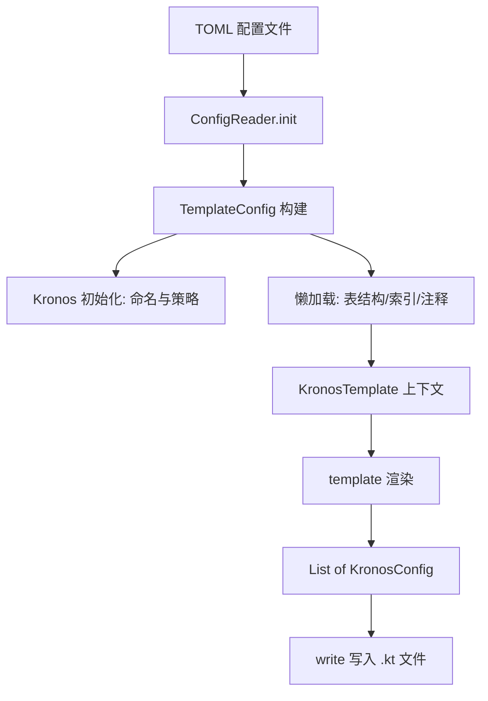
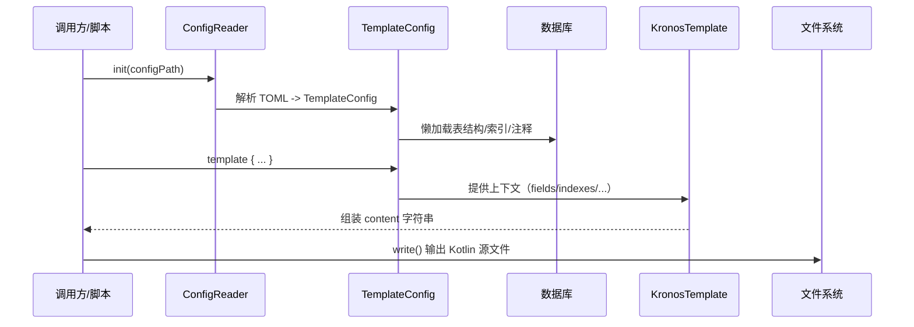

# Kronos Codegen 开发文档

本章节介绍 Kronos-ORM 项目中的 codegen 模块，包含模块结构、设计与架构、功能与 API、用法示例、以及完整的生成流程说明。文末附带 Mermaid 架构图与流程图，帮助快速理解与二次开发。

适用人群：
- 想要从数据库元数据自动生成 Kotlin 数据类（实体/Pojo）的开发者；
- 需要扩展或定制 codegen 逻辑的贡献者；
- 希望在 Gradle/Maven/独立脚本中集成 codegen 的使用者。


## 1. 模块定位与简介
[扩展版](/develop-docs/kronos-codegen/sections/zh_CN/01-模块定位与简介.md)

kronos-codegen 负责根据数据库表结构与配置，生成 Kotlin 数据类文件，并自动配置注解（如 @PrimaryKey、@CreateTime、@UpdateTime 等）和表索引注解（@TableIndex）。

核心能力：
- 读取 TOML 配置，初始化数据源与生成策略；
- 从数据库读取表结构、索引、表注释；
- 提供模板 DSL 组合 Kotlin 文件内容；
- 将内容写入到目标目录的 .kt 文件。


## 2. 目录结构与关键类

源码位置：`kronos-codegen/src/main/kotlin/com/kotlinorm/codegen`

- ConfigReader.kt
  - `init(path: String)`: 读取 TOML 配置并初始化全局 `codeGenConfig: TemplateConfig`。
  - `readConfig(path: String)`: 递归合并 `extend` 配置。
- TemplateConfig.kt
  - 聚合生成上下文：表名、类名、表注释、字段、索引等的懒加载；
  - 初始化 Kronos 的命名与通用策略；
  - `template { ... }`: 接收模板渲染闭包，返回 `List<KronosConfig>`。
- KronosTemplate.kt
  - 模板渲染辅助：
    - 字段注解推导（主键/必要/默认值/时间/逻辑删除/乐观锁等）；
    - 索引注解生成；
    - 表注释自动折行与 `imports` 管理；
    - `+""` 运算符用于拼接最终 `content` 字符串。
- KronosConfig.kt
  - `List<KronosConfig>.write()`: 将模板生成的字符串写入指定 `outputPath`。
- DataSourceHelper.kt
  - `initialDataSource(config)`: 反射创建并配置数据源；
  - `createWrapper(className, ds)`: 包装为 `KronosDataSourceWrapper`。
- Extensions.kt
  - `Field.kotlinType`: 将数据库列类型映射到 Kotlin 类型；
  - `MAX_COMMENT_LINE_WORDS`: 注释换行宽度默认值。

依赖交互：
- 通过 `com.kotlinorm.database.SqlManager` 读取表字段与索引；
- 通过 `com.kotlinorm.orm.ddl.queryTableComment` 读取表注释；
- 通过 `com.kotlinorm.Kronos` 共享命名与策略的全局上下文。


## 3. 配置文件（TOML）

最小示例：

```toml
[[table]]
name = "user"
className = "User"

[strategy]
tableNamingStrategy = "lineHumpNamingStrategy"  # or "noneNamingStrategy"
fieldNamingStrategy = "lineHumpNamingStrategy"
createTimeStrategy = "create_time"
updateTimeStrategy = "update_time"
logicDeleteStrategy = "deleted"
# optimisticLockStrategy = "version"
# primaryKeyStrategy = "id"  # 自动识别主键策略字段

[output]
targetDir = "./build/generated/kotlin/main"
packageName = "com.example.generated"  # 可选；不填将从 targetDir 推断
tableCommentLineWords = 80                # 可选

[dataSource]
dataSourceClassName = "org.apache.commons.dbcp2.BasicDataSource"   # 可选，默认
wrapperClassName = "com.kotlinorm.KronosBasicWrapper"               # 可选，默认
url = "jdbc:mysql://localhost:3306/demo?useUnicode=true&characterEncoding=utf-8"
username = "root"
password = "root"
driverClassName = "com.mysql.cj.jdbc.Driver"
initialSize = 5
maxActive = 10
```

高级：支持 `extend` 字段实现多文件继承与覆盖：

```toml
extend = "base.toml"
```


## 4. 生成流程（概览）

- 调用 `init(configPath)` 读取并解析 TOML；
- 构建 `TemplateConfig` 并初始化 Kronos 全局策略；
- 懒加载数据库表结构（字段、索引、注释）；
- 在 `template { ... }` 中组织 Kotlin 文件内容；
- 调用 `.write()` 将内容写入磁盘。


## 5. 开发者 API 速览

- 初始化
  - `init(path: String)`
- 模板驱动
  - `TemplateConfig.template { ... } : List<KronosConfig>`
  - `List<KronosConfig>.write()`
- 模板上下文（KronosTemplate 中可用）
  - `packageName: String`
  - `tableName: String`
  - `className: String`
  - `tableComment: String`
  - `fields: List<Field>`
  - `indexes: List<KTableIndex>`
  - `imports: MutableSet<String>`
  - `formatedComment: String`（表注释，按宽度折行）
  - `indent(num: Int)`（缩进）
  - `operator fun String?.unaryPlus()`（向内容追加新行）
  - `Field.annotations(): List<String>`（基于策略推导字段注解）
  - `List<KTableIndex>.toAnnotations(): String?`（表索引注解）
- 类型映射
  - `Field.kotlinType: String`（数据库列 -> Kotlin 类型）


## 6. 用法示例（独立脚本/测试同款）

Kotlin 伪代码（基于 `kronos-testing` 中的 `CodeGenerateTest`）：

```kotlin
val configPath = "path/to/config.toml"
init(configPath)

TemplateConfig.template {
    +"package $packageName"
    +""
    +imports.joinToString("\n") { "import $it" }
    +""
    +formatedComment
    +"// @author: Kronos-Codegen"
    +"// @date: ${java.time.LocalDateTime.now()}"
    +""
    +"@Table(name = \"$tableName\")"
    +indexes.toAnnotations()
    +"data class $className("
    fields.forEach { field ->
        field.annotations().forEach { anno -> +"    $anno" }
        +"    var ${field.name}: ${field.kotlinType}? = null,"
    }
    +"): KPojo"
}.write()
```


## 7. 生成文件组织

- 输出目录：由 `output.targetDir` 控制，例如：`build/generated/kotlin/main`；
- 包名：优先使用 `output.packageName`；缺省时从 `targetDir` 的 `main/kotlin/` 之后截取目录并替换为包名；找不到则回退到 `com.kotlinorm.orm.table`；
- 文件名：`<className>.kt`，由 `table[].className` 或命名策略推导获得。


## 8. 策略与注解说明

- 命名策略
  - `lineHumpNamingStrategy`：数据库下划线 -> Kotlin 驼峰；
  - `noneNamingStrategy`：保持原样；
- 时间/删除/乐观锁/主键策略
  - 在 `strategy` 中配置字段名（如 `create_time`、`update_time`、`deleted`、`version`、`id`）；
  - 模板在渲染时会基于这些策略自动追加相应注解（`@CreateTime`、`@UpdateTime`、`@LogicDelete`、`@Version`、`@PrimaryKey`）。
- 字段注解
  - `@PrimaryKey(identity = true)`：自增主键；
  - `@Necessary`：非空、且不是主键；
  - `@Default("<value>")`：列默认值；
  - `@ColumnType(type = KColumnType.XXX, length = L, scale = S)`：当列类型与默认推导不完全一致时保留精确信息；
- 索引注解
  - `@TableIndex(name = ..., columns = [...], type = ..., method = ..., concurrently = ...)`


## 9. 与其他模块的关系

- 依赖 `kronos-core` 中的 DSL/枚举/注解定义；
- 通过 `kronos-jdbc-wrapper` 或默认 `KronosBasicWrapper` 与数据源交互；
- 可结合 `kronos-gradle-plugin` / `kronos-maven-plugin` 做构建期集成（本页聚焦底层 API）。


## 10. Mermaid 架构图




## 11. Mermaid 生成流程（时序）




## 12. 常见问题（FAQ）

- 连接数据库失败？
  - 检查 `dataSource` 配置（url/driver/用户名密码）；
  - 若使用默认 `BasicDataSource`，确保依赖已在运行时可用；
- 找不到 wrapper 构造函数？
  - `createWrapper` 会尝试 `Wrapper(DataSource)` 与 `Wrapper(javax.sql.DataSource)` 两种构造签名；
  - 如自定义 Wrapper，确保其中之一可用；
- 生成的包名不对？
  - 显式设置 `output.packageName`；
  - 或确认 `targetDir` 是否包含 `main/kotlin/` 路径段以便自动推导；
- 注释换行不合适？
  - 使用 `output.tableCommentLineWords` 控制宽度；默认见 `MAX_COMMENT_LINE_WORDS`。


## 13. 参与贡献

欢迎通过 PR 改进模板 DSL、类型映射、注解推导与更多数据源兼容性。提交前请运行相关测试（见 `kronos-testing`）。
