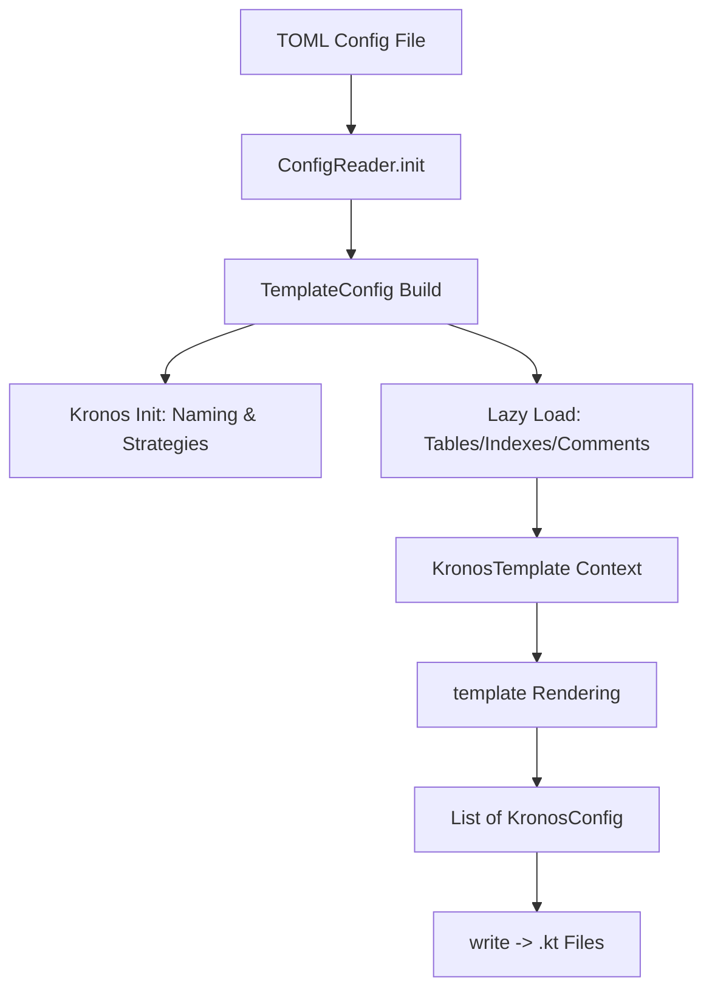
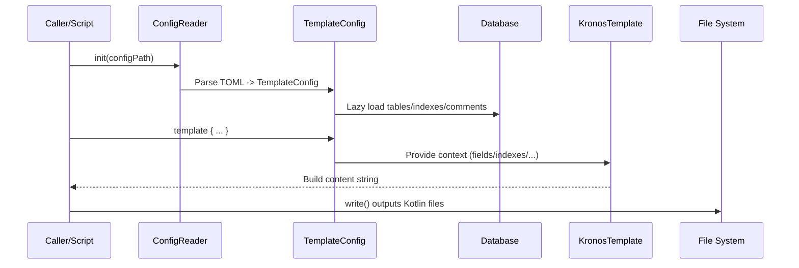

# Kronos Codegen Developer Guide

This document introduces the codegen module in Kronos-ORM, including its structure, design and architecture, features and APIs, usage examples, and the full generation flow. Mermaid architecture and sequence diagrams are provided at the end to help understand and extend the module quickly.

Who is this for:
- Developers who want to generate Kotlin data classes (entities/POJOs) from database metadata automatically;
- Contributors who need to extend or customize codegen logic;
- Users who want to integrate codegen in Gradle/Maven/standalone scripts.


## 1. Module Overview
[See details](/develop-docs/kronos-codegen/sections/en/01-module-overview.md)

kronos-codegen reads configuration (TOML), connects to a database, loads table metadata (columns, indexes, table comments), and generates Kotlin source files with proper annotations (e.g. @PrimaryKey, @CreateTime, @UpdateTime) and table index annotations (@TableIndex).

Core capabilities:
- Parse TOML configuration and initialize generation strategies and data source;
- Read table structure, indexes, and comments from DB;
- Provide a template DSL to assemble Kotlin source content;
- Write the rendered content to .kt files under a target directory.


## 2. Layout and Key Classes
[See details](/develop-docs/kronos-codegen/sections/en/02-layout-and-key-classes.md)

Source path: `kronos-codegen/src/main/kotlin/com/kotlinorm/codegen`

- ConfigReader.kt
  - `init(path: String)`: Read TOML and initialize global `codeGenConfig: TemplateConfig`.
  - `readConfig(path: String)`: Recursively merge config via `extend`.
- TemplateConfig.kt
  - Aggregates generation context with lazy-loading for table names, class names, comments, fields, and indexes;
  - Initializes Kronos naming and common strategies;
  - `template { ... }`: Accepts a template render closure and returns `List<KronosConfig>`.
- KronosTemplate.kt
  - Template helper:
    - Infers field annotations (primary key/necessary/default/time/logical delete/optimistic lock);
    - Generates index annotations;
    - Formats table comments and manages `imports` set;
    - Overloaded unary plus `+""` to append content lines.
- KronosConfig.kt
  - `List<KronosConfig>.write()`: Write rendered strings to `outputPath`.
- DataSourceHelper.kt
  - `initialDataSource(config)`: Create and configure a DataSource via reflection;
  - `createWrapper(className, ds)`: Wrap the DataSource into `KronosDataSourceWrapper`.
- Extensions.kt
  - `Field.kotlinType`: Map DB column types to Kotlin types;
  - `MAX_COMMENT_LINE_WORDS`: Default wrapping width for comments.

Module interactions:
- Uses `com.kotlinorm.database.SqlManager` to load columns and indexes;
- Uses `com.kotlinorm.orm.ddl.queryTableComment` to read table comments;
- Uses `com.kotlinorm.Kronos` for shared global naming/strategy context.


## 3. Configuration (TOML)
[See details](/develop-docs/kronos-codegen/sections/en/03-configuration-toml.md)

Minimal example:

```toml
[[table]]
name = "user"
className = "User"

[strategy]
tableNamingStrategy = "lineHumpNamingStrategy"  # or "noneNamingStrategy"
fieldNamingStrategy = "lineHumpNamingStrategy"
createTimeStrategy = "create_time"
updateTimeStrategy = "update_time"
logicDeleteStrategy = "deleted"
# optimisticLockStrategy = "version"
# primaryKeyStrategy = "id"  # auto-recognize primary key strategy field

[output]
targetDir = "./build/generated/kotlin/main"
packageName = "com.example.generated"  # optional; inferred from targetDir if omitted
tableCommentLineWords = 80               # optional

[dataSource]
dataSourceClassName = "org.apache.commons.dbcp2.BasicDataSource"   # optional, default
wrapperClassName = "com.kotlinorm.KronosBasicWrapper"               # optional, default
url = "jdbc:mysql://localhost:3306/demo?useUnicode=true&characterEncoding=utf-8"
username = "root"
password = "root"
driverClassName = "com.mysql.cj.jdbc.Driver"
initialSize = 5
maxActive = 10
```

Advanced: support config inheritance/override via `extend`:

```toml
extend = "base.toml"
```


## 4. Generation Flow (Overview)
[See details](/develop-docs/kronos-codegen/sections/en/04-generation-flow.md)

- Call `init(configPath)` to parse TOML;
- Build `TemplateConfig` and initialize Kronos global strategies;
- Lazy-load table structures (fields, indexes, comments);
- Use `template { ... }` to organize Kotlin content;
- Call `.write()` to write content to disk.


## 5. Developer API Quick Reference
[See details](/develop-docs/kronos-codegen/sections/en/05-developer-api.md)

- Initialization
  - `init(path: String)`
- Template-driven rendering
  - `TemplateConfig.template { ... } : List<KronosConfig>`
  - `List<KronosConfig>.write()`
- Template context (available within KronosTemplate)
  - `packageName: String`
  - `tableName: String`
  - `className: String`
  - `tableComment: String`
  - `fields: List<Field>`
  - `indexes: List<KTableIndex>`
  - `imports: MutableSet<String>`
  - `formatedComment: String` (table comment wrapped to width)
  - `indent(num: Int)` (indentation)
  - `operator fun String?.unaryPlus()` (append a new line)
  - `Field.annotations(): List<String>` (derive field annotations per strategies)
  - `List<KTableIndex>.toAnnotations(): String?` (table index annotations)
- Type mapping
  - `Field.kotlinType: String` (DB column -> Kotlin type)


## 6. Usage Example (standalone/script or test-like)
[See details](/develop-docs/kronos-codegen/sections/en/06-usage-examples.md)

Kotlin pseudo code (modeled after `kronos-testing`’s `CodeGenerateTest`):

```kotlin
val configPath = "path/to/config.toml"
init(configPath)

TemplateConfig.template {
    +"package $packageName"
    +""
    +imports.joinToString("\n") { "import $it" }
    +""
    +formatedComment
    +"// @author: Kronos-Codegen"
    +"// @date: ${java.time.LocalDateTime.now()}"
    +""
    +"@Table(name = \"$tableName\")"
    +indexes.toAnnotations()
    +"data class $className("
    fields.forEach { field ->
        field.annotations().forEach { anno -> +"    $anno" }
        +"    var ${field.name}: ${field.kotlinType}? = null,"
    }
    +"): KPojo"
}.write()
```


## 7. Output Organization
[See details](/develop-docs/kronos-codegen/sections/en/07-output-organization.md)

- Output directory: controlled by `output.targetDir`, e.g., `build/generated/kotlin/main`;
- Package name: first use `output.packageName`. If omitted, infer from the directory segment after `main/kotlin/`. Fallback: `com.kotlinorm.orm.table`;
- File name: `<className>.kt`, derived from `table[].className` or naming strategy.


## 8. Strategies and Annotations
[See details](/develop-docs/kronos-codegen/sections/en/08-strategies-and-annotations.md)

- Naming strategies
  - `lineHumpNamingStrategy`: snake_case (DB) -> camelCase (Kotlin);
  - `noneNamingStrategy`: keep original naming;
- Time/Delete/Version/Primary key strategies
  - Configure field names in `strategy` (e.g., `create_time`, `update_time`, `deleted`, `version`, `id`);
  - During rendering, matching fields get annotations automatically (`@CreateTime`, `@UpdateTime`, `@LogicDelete`, `@Version`, `@PrimaryKey`).
- Field annotations
  - `@PrimaryKey(identity = true)`: auto-increment PK;
  - `@Necessary`: non-null and not a primary key;
  - `@Default("<value>")`: default value on column;
  - `@ColumnType(type = KColumnType.XXX, length = L, scale = S)`: keep precise column info when default inference isn’t enough;
- Index annotations
  - `@TableIndex(name = ..., columns = [...], type = ..., method = ..., concurrently = ...)`.


## 9. Relationship with Other Modules
[See details](/develop-docs/kronos-codegen/sections/en/09-relationships-to-other-modules.md)

- Depends on DSL/enums/annotations in `kronos-core`;
- Interacts with data sources via `kronos-jdbc-wrapper` or the default `KronosBasicWrapper`;
- Can be integrated at build time using `kronos-gradle-plugin` / `kronos-maven-plugin` (this page focuses on the low-level API).


## 10. Mermaid Architecture Diagram
[See details](/develop-docs/kronos-codegen/sections/en/10-architecture-mermaid.md)




## 11. Mermaid Sequence (Generation Flow)
[Expanded version](/develop-docs/kronos-codegen/sections/en/11-sequence-mermaid.md)




## 12. FAQ
[See details](/develop-docs/kronos-codegen/sections/en/12-faq.md)

- Database connection failure?
  - Verify `dataSource` settings (url/driver/username/password);
  - If using default `BasicDataSource`, make sure the dependency is available at runtime.
- Wrapper constructor not found?
  - `createWrapper` tries both `Wrapper(DataSource)` and `Wrapper(javax.sql.DataSource)` constructors;
  - Ensure your custom wrapper exposes one of these.
- Wrong package name in output?
  - Set `output.packageName` explicitly; or ensure `targetDir` contains `main/kotlin/` so it can be inferred.
- Comment wrapping width not suitable?
  - Use `output.tableCommentLineWords` to control width; default is `MAX_COMMENT_LINE_WORDS`.


## 13. Contributing
[Expanded version](/develop-docs/kronos-codegen/sections/en/13-contributing.md)

Contributions are welcome to improve the template DSL, type mapping, annotation inference, and data source compatibility. Please run related tests before submitting PRs (see `kronos-testing`).
