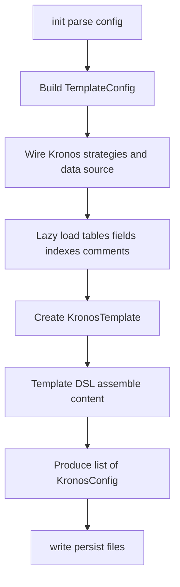

# 4. Generation Flow (Expanded)

This chapter walks through end-to-end generation with algorithmic checkpoints and a flowchart.

1. init(configPath)
- Calls `readConfig`; validates schema; builds `TemplateConfig`.
- Side effect: wires Kronos global strategies and global data source wrapper.

2. Lazy metadata resolution
- `TemplateConfig` defers fetching `fields`, `indexes`, and `tableComments` until first access.
- Pros: If a template only needs fields but not indexes, only fields are fetched.

3. Template rendering
- `TemplateConfig.template { ... }` iterates through tables and creates `KronosTemplate` per table.
- Within the lambda, you build up `content` using:
  - `+` operator to append lines.
  - `fields.forEach { ... }` traversing DB columns in DSL `Field` form.
  - `field.annotations()` to obtain annotations based on strategies & column properties.
  - `indexes.toAnnotations()` to include table index annotations.
  - `formatedComment` for header comments.
  - `imports` auto-augmented by helper methods.

4. Persist results
- `List<KronosConfig>.write()` ensures directories exist and writes the content.
- Logging confirms the destination file path for each artifact.

## Failure points and handling

- DB connectivity issues surface during lazy calls (fields/indexes/comments). Favor explicit exception messages at the integration layer.
- Unsupported DataSource properties are warned, not fatal, to ease cross-DS usage.
- Missing strategies are treated as absent features (no extra annotations), keeping output valid.
