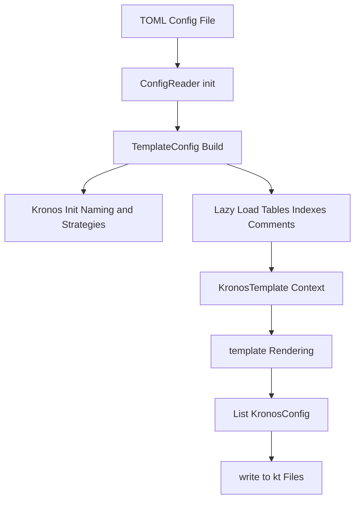

# 10. Architecture Diagram (Expanded)

This chapter explains the data flow and shows the Mermaid diagram.

- Config file -> ConfigReader.init
  - Source of truth for inputs and strategies.
- TemplateConfig Build
  - Central hub that binds strategies and exposes lazy metadata providers.
- Kronos Init
  - Side-effectful step to synchronize global naming and strategies across modules.
- Lazy Load
  - Queries are executed only when templates access `fields`, `indexes`, or `tableComments`.
- KronosTemplate Context
  - A rendering scope with helpers for annotations, imports, and comments.
- template Rendering -> List<KronosConfig>
  - Pure function from context + template code to content strings.
- write -> .kt files
  - IO boundary; ensure idempotent writes (same content overwrites).
