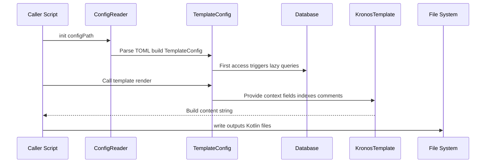

# 11. Sequence Diagram (Expanded)

Complementary to the architecture diagram, the sequence shows runtime interactions and includes a Mermaid diagram.

- App calls `init(configPath)` on ConfigReader.
- ConfigReader builds TemplateConfig and wires Kronos.
- First access to metadata triggers DB calls.
- App calls `TemplateConfig.template { ... }` and the template code assembles content.
- `write()` finalizes IO.

Design note: separating init and render allows you to cache metadata across multiple template runs if desired (by reusing `codeGenConfig`).