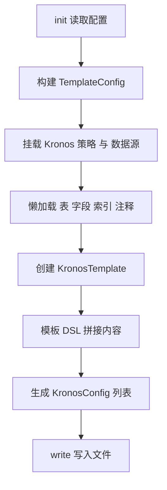

# 4. 生成流程（扩展）

本章以端到端视角讲解生成过程中的关键算法节点，并提供流程图帮助理解。

1. init(configPath)
- 调用 `readConfig`；校验结构；构建 `TemplateConfig`。
- 副作用：挂载 Kronos 全局策略与全局数据源包装。

2. 元数据懒加载
- `TemplateConfig` 延迟加载 `fields`、`indexes`、`tableComments`，首次访问时触发。
- 好处：模板只用到字段时，不会产生索引查询开销。

3. 模板渲染
- `TemplateConfig.template { ... }` 为每张表构造 `KronosTemplate`。
- 在闭包中通过以下能力构建 `content`：
  - 一元 `+` 逐行追加字符串；
  - `fields.forEach { ... }` 遍历列；
  - `field.annotations()` 基于策略与列属性推导注解；
  - `indexes.toAnnotations()` 生成表索引注解；
  - `formatedComment` 产出头部注释；
  - `imports` 自动补齐所需 import。

4. 结果落盘
- `List<KronosConfig>.write()` 确保目录存在并写入文件；
- 日志输出每个生成文件的目标路径。

## 失败场景与处理

- 数据库连接/权限问题：在懒加载调用时暴露；建议在集成层输出更明确提示。
- DataSource 不支持的属性：记录告警但不中断，以提升跨数据源兼容性。
- 缺失策略：视为未启用相应特性（不输出额外注解），保证输出始终可编译。