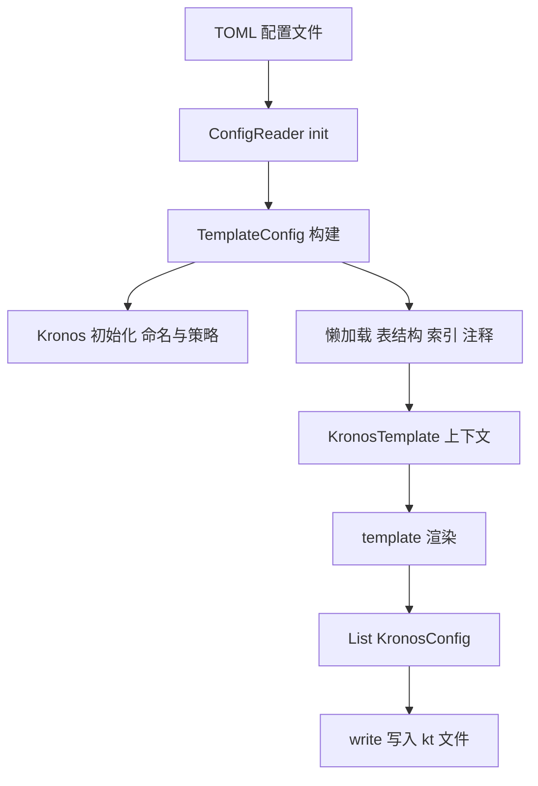

# 10. 架构图（扩展）

本章对 Mermaid 架构图的各节点进行解释，并附上架构图。

- 配置文件 -> ConfigReader.init
  - 输入与策略的单一事实来源。
- TemplateConfig 构建
  - 绑定策略并暴露懒加载的元数据提供者。
- Kronos 初始化
  - 具有副作用的同步步骤：在模块间统一命名与策略配置。
- 懒加载
  - 仅当模板访问 `fields`、`indexes`、`tableComments` 时触发查询。
- KronosTemplate 上下文
  - 提供注解、imports、注释等辅助能力的渲染作用域。
- template 渲染 -> List<KronosConfig>
  - 由上下文与模板代码纯函数地生成字符串内容。
- write -> .kt 文件
  - IO 边界；保持幂等：相同内容覆盖写入。
