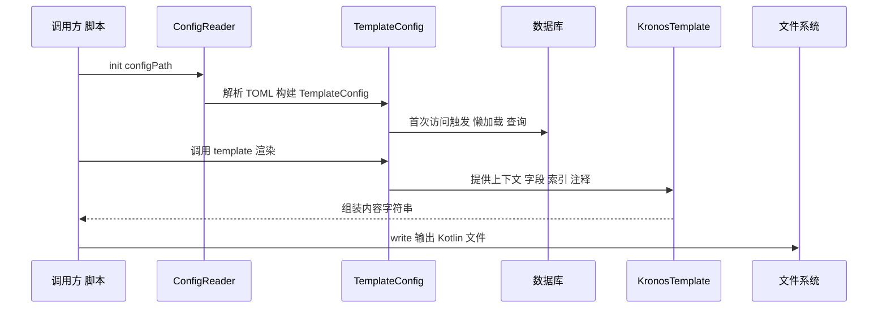

# 11. 时序图（扩展）

下图展示运行时的主要交互顺序：

- 应用调用 ConfigReader 的 `init(configPath)`。
- ConfigReader 构建 TemplateConfig 并挂载 Kronos。
- 首次访问元数据时触发数据库查询。
- 应用调用 `TemplateConfig.template { ... }`，模板组装输出内容。
- 调用 `write()` 完成文件落盘。

设计说明：将初始化与渲染解耦，便于在多次模板运行间复用元数据（复用全局 `codeGenConfig`）。