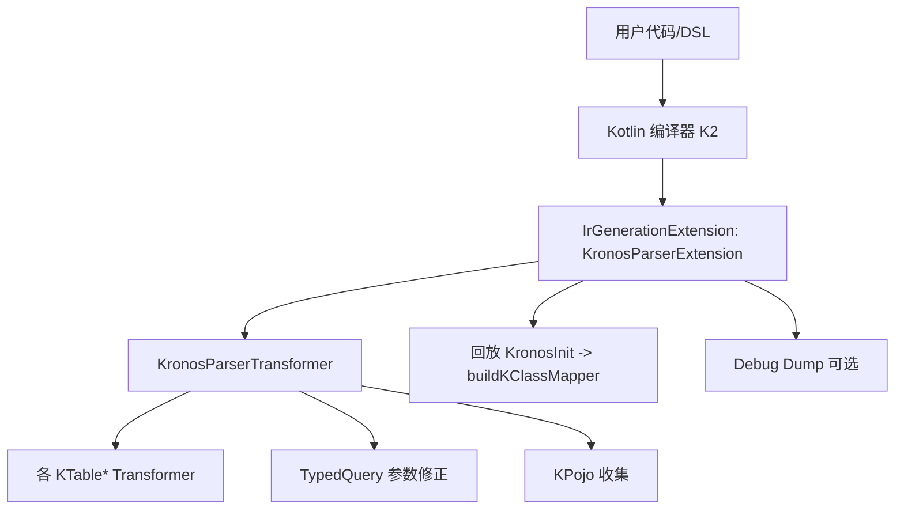
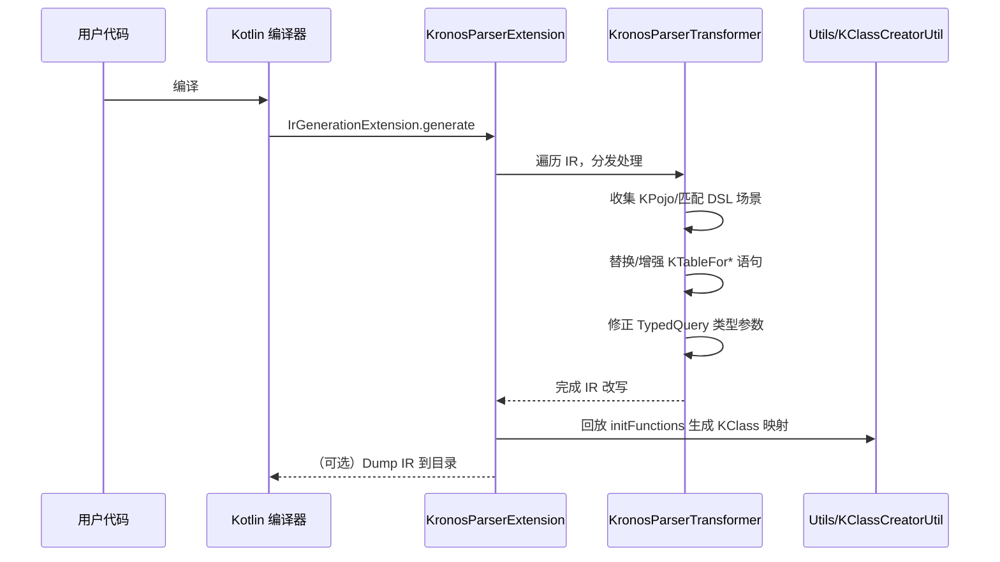

# Kronos Compiler 插件开发文档

本章节介绍 Kronos-ORM 项目中的 kronos-compiler-plugin（下文简称“编译器插件”）。内容包含模块定位、源码结构、编译期 IR 处理流程、可扩展开发者 API、Gradle/Maven 集成方法、示例、故障排查与架构/时序图等，帮助你快速理解与二次开发。

适用人群：
- 需要在编译期对 Kronos DSL 做语义增强与静态检查的使用者；
- 希望扩展/修改 IR 转换逻辑、参与贡献的开发者；
- 需要在 Gradle/Maven 构建中启用 Kotlin 编译器插件的工程实践者。

## 1. 模块定位与简介
[详见](./sections/zh_CN/01-模块定位与简介.md)

kronos-compiler-plugin 是基于 Kotlin K2 的 IR Generation 扩展。插件在编译期扫描和记录 KPojo 类型、捕获 Kronos DSL 中的查询/表达式，并对 IR 进行改写：
- 收集泛型实参中所有实现 KPojo 的类型，用于后续映射与校验；
- 将 KTableForSelect/Set/Condition/Sort/Reference 等 DSL 表达式解析为显式的内部调用（如 addFieldList）；
- 对特定 API（TypedQuery/SelectFrom 系列）注入/修正类型参数；
- 提供 @KronosInit 钩子，延后在模块末尾统一生成 KClass 映射方法。

## 2. 目录结构与关键类
[详见](./sections/zh_CN/02-目录结构与关键类.md)

源码位置：`kronos-compiler-plugin/src/main/kotlin/com/kotlinorm/compiler`。
重点文件：
- plugin/
  - KronosParserCompilerPluginRegistrar：注册 IrGenerationExtension；读取命令行选项；
  - KronosCommandLineProcessor：定义/解析插件命令行参数（debug、debug-info-path）；
  - KronosParserExtension：编译入口，驱动 IR 遍历与调试信息输出；
  - transformer/KronosParserTransformer：核心 IR 变换调度；分发到各 KTable* 变换；
- transformer/kTable/
  - KTableParserForSelect/Set/Condition/Sort/ReferenceTransformer：分别处理不同 DSL 上下文；
- utils/
  - KClassCreatorUtil：收集 @KronosInit 初始函数，编译后期统一生成映射；
  - 各种 Ir*Helper 与 KTableFor*Util：封装 IR 构造、字段收集与参数改写逻辑。

## 3. 构建集成与插件参数
[详见](./sections/zh_CN/03-构建集成与插件参数.md)

- Gradle Kotlin DSL 使用方法（kotlinOptions.freeCompilerArgs、K2 支持）；
- Maven 使用方法（kotlin-maven-plugin 配置）；
- 插件参数：
  - debug=true|false：开启 IR dump；
  - debug-info-path=path：IR dump 输出目录（默认 build/tmp/kronosIrDebug）。

## 4. IR 处理流程（概览）
[详见](./sections/zh_CN/04-IR处理流程.md)

- 进入 generate(module, context)；
- 先 resetKClassCreator(); 再执行 KronosParserTransformer；
- 扫描并收集 KPojo 类型、@KronosInit 的初始化函数；
- 对 KTableForSelect/Set/Condition/Sort/Reference 等函数体进行替换/增强；
- 对 TypedQuery/SelectFrom* 进行类型参数修正；
- 编译末尾回放 initFunctions，生成 KClass 映射；
- 若 debug 开启，dump IR 到指定目录。

## 5. 开发者 API（扩展点）
[详见](./sections/zh_CN/05-开发者API.md)

- 如何新增一个 DSL 上下文的 IR 变换器；
- 如何接入/识别新的注解作为初始化钩子；
- 如何在 utils 中新增通用 IR 构造 helper；
- 如何扩展 TypedQuery 参数修正逻辑。

## 6. 各 Transformer 详解
[详见](/develop-docs/kronos-compiler/sections/zh_CN/06-各Transformer详解.md)

- 逐一介绍 Select/Set/Condition/Sort/Reference 变换的触发条件与改写目标；
- 展示每类变换注入/替换的典型 IR 片段；
- 说明与 TypedQuery 类型修正、KPojo 收集的协同关系。

## 7. 与其他模块的关系
[详见](/develop-docs/kronos-compiler/sections/zh_CN/07-与其他模块的关系.md)

- 依赖 kronos-core 的接口/注解/DSL；
- 与 kronos-codegen 的边界（编译期 vs 生成期）；
- 与 kronos-gradle-plugin / kronos-maven-plugin 的协作（如何启用编译器插件）。

## 8. Mermaid 架构图
[扩展版](/develop-docs/kronos-compiler/sections/zh_CN/08-架构图.md)

## 9. Mermaid 时序图（编译期处理）
[扩展版](/develop-docs/kronos-compiler/sections/zh_CN/09-时序图.md)

## 10. 调试与故障排查
[扩展版](/develop-docs/kronos-compiler/sections/zh_CN/10-调试与故障排查.md)

- 如何打开 debug 与 IR dump；
- 常见错误：未启用 K2、找不到插件 ID、命令行参数拼写错误、IR 转换 NPE；
- 定位方式：开启 dump，定位到对应源文件的 IR；
- 最佳实践：为每个新变换写单元测试（见 kronos-compiler-plugin/src/test）。

## 11. 常见问题（FAQ）
[扩展版](/develop-docs/kronos-compiler/sections/zh_CN/11-FAQ.md)

- 插件如何启用？如何确认生效？
- 与 KAPT/KSP 是否冲突？
- 为什么需要 K2？K1 支持如何？
- 如何自定义 DSL 的扩展？

## 12. 参与贡献
[扩展版](/develop-docs/kronos-compiler/sections/zh_CN/12-参与贡献.md)

欢迎通过 PR 改进 IR 变换、TypedQuery 处理、调试能力与测试覆盖。提交前请运行相关测试用例。