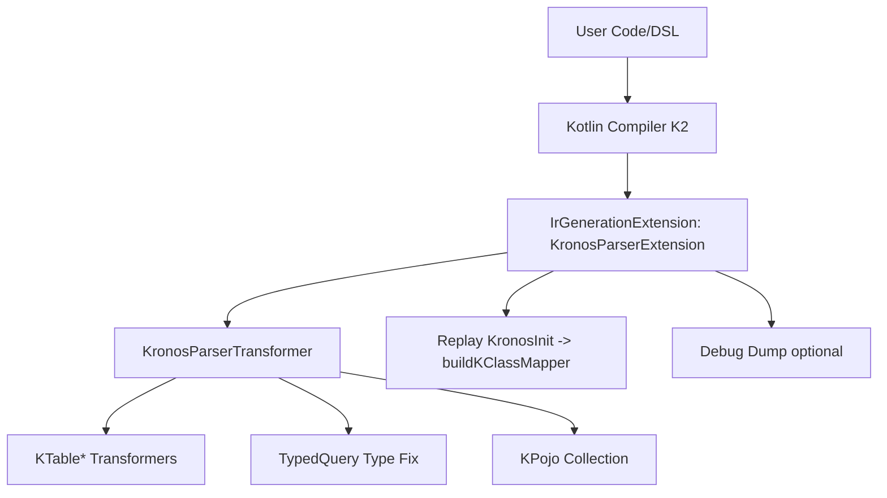
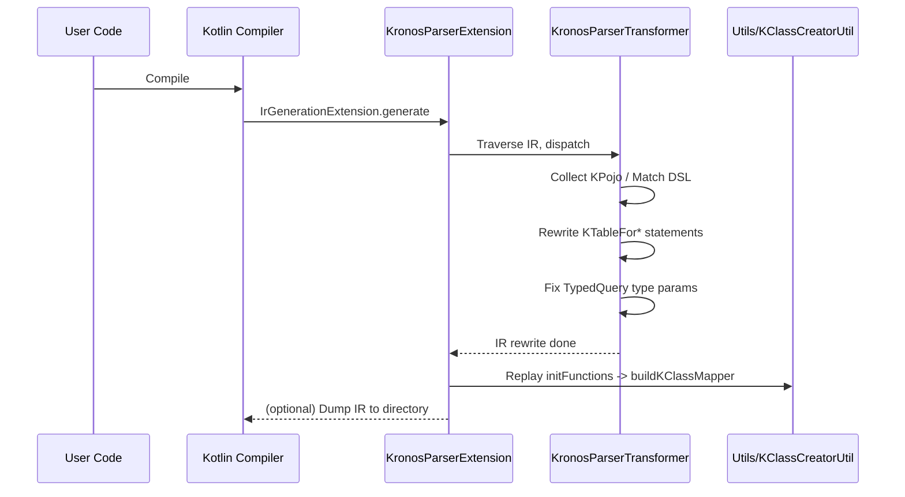

# Kronos Compiler Plugin Developer Guide

This guide introduces the kronos-compiler-plugin module in Kronos-ORM. It covers the module’s purpose, source layout, IR processing flow, developer extension APIs, Gradle/Maven integration, examples, troubleshooting, and architecture/sequence diagrams to help you understand and extend it quickly.

Who is this for:
- Users who want compile-time semantic enhancement and static checks for Kronos DSL;
- Contributors who want to extend/modify IR transformations;
- Engineers who need to enable the Kotlin compiler plugin in Gradle/Maven builds.

## 1. Module Overview
[See details](./sections/en/01-module-overview.md)

kronos-compiler-plugin is an IR Generation extension for Kotlin K2. During compilation, the plugin scans and records KPojo types, captures Kronos DSL queries/expressions, and rewrites IR:
- Collects all types implementing KPojo from generic arguments for mapping and validation later;
- Parses KTableForSelect/Set/Condition/Sort/Reference DSL expressions into explicit internal calls (e.g., addFieldList);
- Injects/fixes type parameters for certain APIs (TypedQuery/SelectFrom*);
- Provides a @KronosInit hook to defer KClass mapping generation to the end of the module.

## 2. Layout and Key Classes
[See details](./sections/en/02-layout-and-key-classes.md)

Source path: `kronos-compiler-plugin/src/main/kotlin/com/kotlinorm/compiler`.
Key files:
- plugin/
  - KronosParserCompilerPluginRegistrar: registers IrGenerationExtension; reads CLI options;
  - KronosCommandLineProcessor: defines/parses plugin options (debug, debug-info-path);
  - KronosParserExtension: compilation entry point, drives IR traversal and optional debug dump;
  - transformer/KronosParserTransformer: core IR transformation dispatcher; delegates to each KTable* transformer;
- transformer/kTable/
  - KTableParserForSelect/Set/Condition/Sort/ReferenceTransformer: handle different DSL contexts respectively;
- utils/
  - KClassCreatorUtil: collects @KronosInit initializer functions; generates mappings at the end of compilation;
  - Various Ir*Helper and KTableFor*Util: encapsulate IR construction, field collection, and parameter fixes.

## 3. Build Integration and Options
[See details](./sections/en/03-build-integration-and-options.md)

- Gradle Kotlin DSL usage (kotlinOptions.freeCompilerArgs, K2 support);
- Maven usage (kotlin-maven-plugin setup);
- Plugin options:
  - debug=true|false: enable IR dump;
  - debug-info-path=path: output directory for IR dump (default build/tmp/kronosIrDebug).

## 4. IR Processing Flow (Overview)
[See details](./sections/en/04-ir-processing.md)

- Enter generate(module, context);
- Call resetKClassCreator(); then run KronosParserTransformer;
- Scan and collect KPojo types and @KronosInit initializers;
- Replace/enhance bodies for KTableForSelect/Set/Condition/Sort/Reference;
- Fix type parameters for TypedQuery/SelectFrom*;
- Replay initFunctions at end of compilation to generate KClass mapping;
- If debug is on, dump IR to target directory.

## 5. Developer API (Extension Points)
[See details](./sections/en/05-developer-api.md)

- How to add a new DSL-context transformer;
- How to plug in/recognize a new initialization annotation;
- How to add common IR helper utilities;
- How to extend TypedQuery parameter fix rules.

## 6. Transformers in Detail
[See details](./sections/en/06-transformers.md)

- Trigger conditions and rewrite goals for Select/Set/Condition/Sort/Reference;
- Typical IR fragments injected/replaced by each transformer;
- How these cooperate with TypedQuery fixes and KPojo collection.

## 7. Relationship with Other Modules
[See details](./sections/en/07-relationships-to-other-modules.md)

- Depends on kronos-core interfaces/annotations/DSL;
- Boundary with kronos-codegen (compile-time vs generation-time);
- Collaboration with kronos-gradle-plugin / kronos-maven-plugin for enabling the compiler plugin.

## 8. Mermaid Architecture Diagram
[Expanded version](./sections/en/08-architecture-mermaid.md)

## 9. Mermaid Sequence (Compile-time)
[Expanded version](./sections/en/09-sequence-mermaid.md)

## 10. Debugging and Troubleshooting
[Expanded version](./sections/en/10-debugging-and-troubleshooting.md)

- How to enable debug and IR dump;
- Common errors: K2 not enabled, plugin ID not found, wrong CLI option spelling, NPEs in IR transforms;
- Diagnosis: enable dump, locate target IR for source file;
- Best practices: write unit tests for each new transform (see kronos-compiler-plugin/src/test).

## 11. FAQ
[Expanded version](./sections/en/11-faq.md)

- How to enable the plugin? How to confirm it’s active?
- Conflicts with KAPT/KSP?
- Why K2? Is K1 supported?
- How to customize DSL extensions?

## 12. Contributing
[Expanded version](./sections/en/12-contributing.md)

Contributions are welcome to improve IR transforms, TypedQuery handling, debug capabilities, and test coverage. Please run related tests before submitting.
