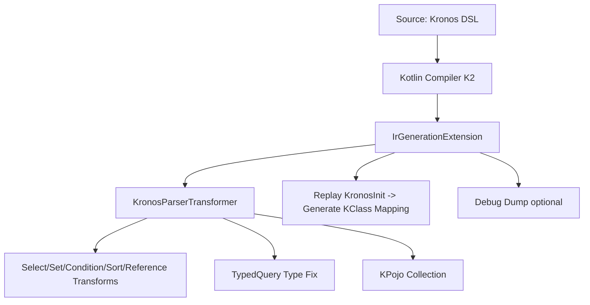

# 8. Mermaid Architecture Diagram

```mermaid
flowchart TD
  A[Source: Kronos DSL] --> B[Kotlin Compiler K2]
  B --> C[IrGenerationExtension]
  C --> D[KronosParserTransformer]
  D --> E[Select/Set/Condition/Sort/Reference Transforms]
  D --> F[TypedQuery Type Fix]
  D --> G[KPojo Collection]
  C --> H[Replay KronosInit -> Generate KClass Mapping]
  C --> I[Debug Dump optional]
```
