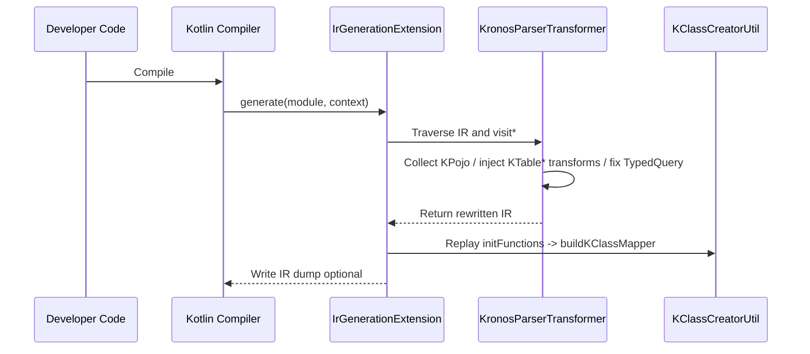

# 9. Mermaid Sequence Diagram

```mermaid
sequenceDiagram
  participant Dev as Developer Code
  participant K2 as Kotlin Compiler
  participant EXT as IrGenerationExtension
  participant TR as KronosParserTransformer
  participant UTIL as KClassCreatorUtil

  Dev->>K2: Compile
  K2->>EXT: generate(module, context)
  EXT->>TR: Traverse IR and visit*
  TR->>TR: Collect KPojo / inject KTable* transforms / fix TypedQuery
  TR-->>EXT: Return rewritten IR
  EXT->>UTIL: Replay initFunctions -> buildKClassMapper
  EXT-->>K2: Write IR dump optional
```
