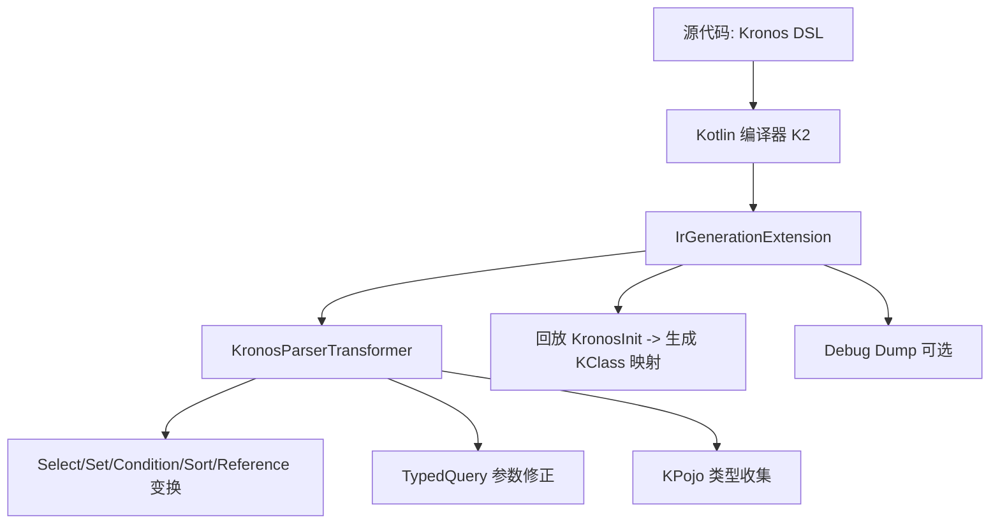

# 8. Mermaid 架构图

```mermaid
flowchart TD
  A[源代码: Kronos DSL] --> B[Kotlin 编译器 K2]
  B --> C[IrGenerationExtension]
  C --> D[KronosParserTransformer]
  D --> E[Select/Set/Condition/Sort/Reference 变换]
  D --> F[TypedQuery 参数修正]
  D --> G[KPojo 类型收集]
  C --> H[回放 KronosInit -> 生成 KClass 映射]
  C --> I[Debug Dump 可选]
```
