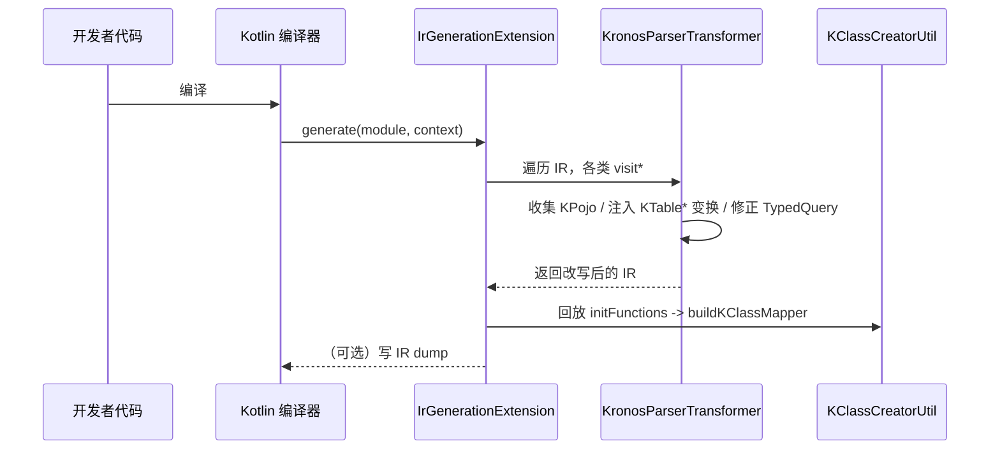

# 9. Mermaid 时序图

```mermaid
sequenceDiagram
  participant Dev as 开发者代码
  participant K2 as Kotlin 编译器
  participant EXT as IrGenerationExtension
  participant TR as KronosParserTransformer
  participant UTIL as KClassCreatorUtil

  Dev->>K2: 编译
  K2->>EXT: generate(module, context)
  EXT->>TR: 遍历 IR，各类 visit*
  TR->>TR: 收集 KPojo / 注入 KTable* 变换 / 修正 TypedQuery
  TR-->>EXT: 返回改写后的 IR
  EXT->>UTIL: 回放 initFunctions -> buildKClassMapper
  EXT-->>K2: （可选）写 IR dump
```
