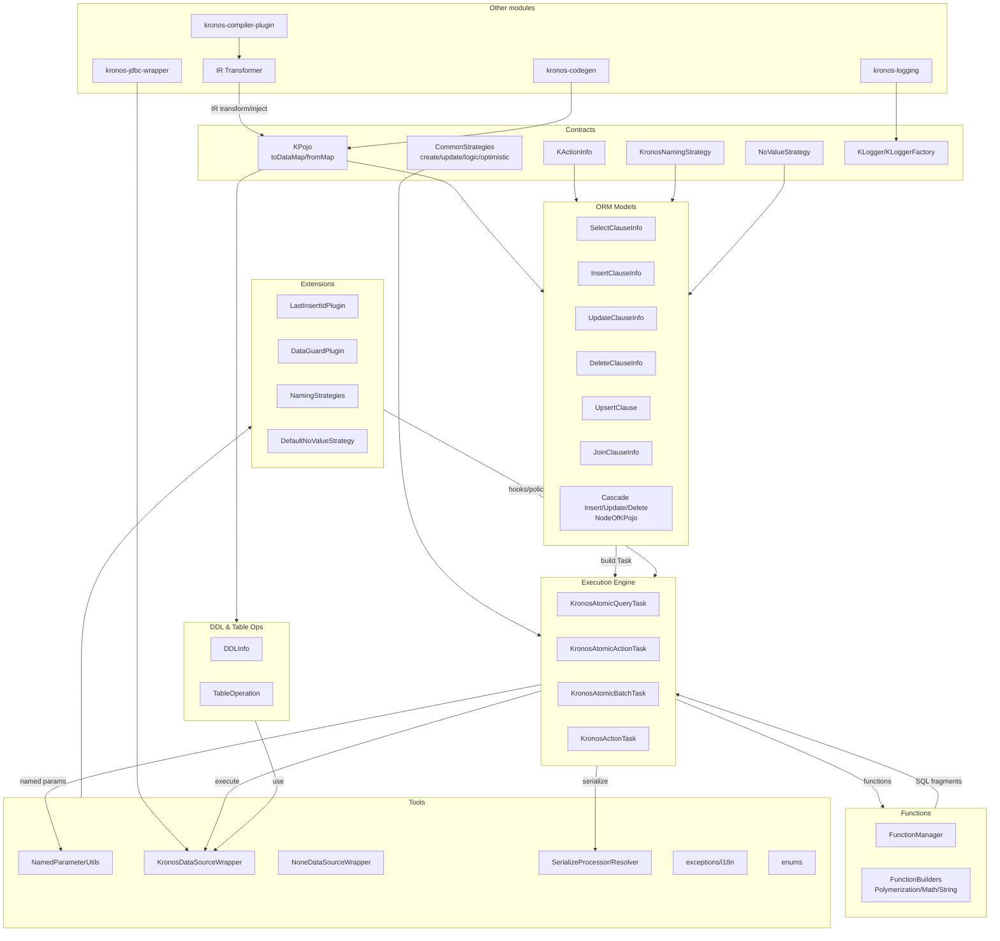
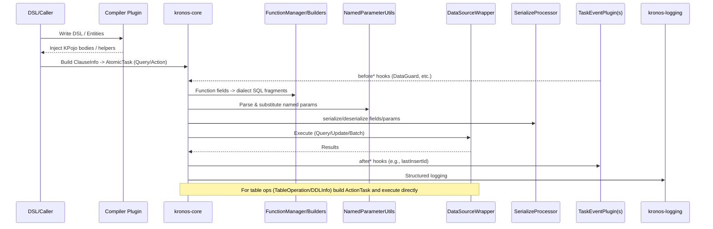

# 4. Architecture & Flow (Top)

Components diagram:

```mermaid
flowchart TD
  %% Contracts
  subgraph API[Contracts]
    A[KPojo <br/> toDataMap/fromMap]
    B[KActionInfo]
    C[KronosNamingStrategy]
    D[NoValueStrategy]
    CS[CommonStrategies<br/>create/update/logic/optimistic]
    L[KLogger/KLoggerFactory]
  end

  %% ORM Models
  subgraph ORM[ORM Models]
    S[SelectClauseInfo]
    I[InsertClauseInfo]
    U[UpdateClauseInfo]
    D1[DeleteClauseInfo]
    UP[UpsertClause]
    J[JoinClauseInfo]
    C1[Cascade Insert/Update/Delete<br/>NodeOfKPojo]
  end

  %% Execution / Task Engine
  subgraph EXEC[Execution Engine]
    QT[KronosAtomicQueryTask]
    AT[KronosAtomicActionTask]
    ABT[KronosAtomicBatchTask]
    KT[KronosActionTask]
  end

  %% Functions system
  subgraph FUNC[Functions]
    FM[FunctionManager]
    FB[FunctionBuilders<br/>Polymerization/Math/String]
  end

  %% Tools & Infra
  subgraph Tools[Tools]
    NPU[NamedParameterUtils]
    KDW[KronosDataSourceWrapper]
    NDW[NoneDataSourceWrapper]
    SER[SerializeProcessor/Resolver]
    EX[exceptions/i18n]
    EN[enums]
  end

  %% DDL & Table Ops
  subgraph DDL[DDL & Table Ops]
    DI[DDLInfo]
    TO[TableOperation]
  end

  %% Extensions: plugins & strategies impls
  subgraph Ext[Extensions]
    P[LastInsertIdPlugin]
    DG[DataGuardPlugin]
    NS[NamingStrategies]
    NV[DefaultNoValueStrategy]
  end

  %% Relations
  A --> ORM
  B --> ORM
  C --> ORM
  D --> ORM
  CS --> EXEC

  ORM -->|build Task| EXEC
  EXEC -->|named params| NPU
  EXEC -->|functions| FUNC
  EXEC -->|serialize| SER
  FUNC -->|SQL fragments| EXEC
  EXEC -->|execute| KDW

  Tools --> Ext
  Ext -->|hooks/policies| EXEC

  %% DDL
  A --> DDL
  DDL -->|use| KDW

  %% Other modules
  subgraph Other[Other modules]
    CP[kronos-compiler-plugin]
    TR[IR Transformer]
    JW[kronos-jdbc-wrapper]
    CG[kronos-codegen]
    LOG[kronos-logging]
  end

  CP --> TR
  TR -->|IR transform/inject| A
  JW --> KDW
  CG --> A
  LOG --> L
```

End-to-end flow:

```mermaid
sequenceDiagram
  participant DSL as DSL/Caller
  participant KCP as Compiler Plugin
  participant CORE as kronos-core
  participant FUNC as FunctionManager/Builders
  participant NP as NamedParameterUtils
  participant DS as DataSourceWrapper
  participant SER as SerializeProcessor
  participant P as TaskEventPlugin(s)
  participant LOG as kronos-logging

  DSL->>KCP: Write DSL / Entities
  KCP-->>DSL: Inject KPojo bodies / helpers
  DSL->>CORE: Build ClauseInfo -> AtomicTask (Query/Action)
  P-->>CORE: before* hooks (DataGuard, etc.)
  CORE->>FUNC: Function fields -> dialect SQL fragments
  CORE->>NP: Parse & substitute named params
  CORE->>SER: serialize/deserialize fields/params
  CORE->>DS: Execute (Query/Update/Batch)
  DS-->>CORE: Results
  CORE->>P: after* hooks (e.g., lastInsertId)
  CORE->>LOG: Structured logging

  Note over CORE,DS: For table ops (TableOperation/DDLInfo) build ActionTask and execute directly
```
