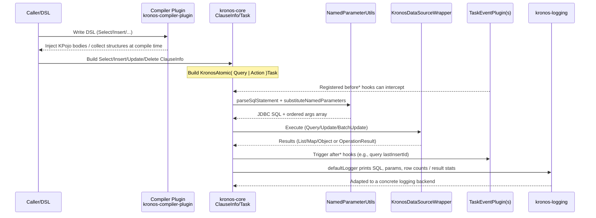

# Runtime Execution Flow

This section shows the end-to-end "SQL generation and execution" path from DSL to the database. It covers the compiler transformer, Action/Query tasks, named parameters, plugins and logging.

Sequence (simplified):

Key notes:
- Transformer (compile-time)
  - kronos-compiler-plugin rewrites/injects KPojo method bodies to ease runtime usages.
- ClauseInfo -> Task
  - ClauseInfo is only a data carrier; Task chains named parameter parsing, data source execution, plugins and logging.
- NamedParameterUtils
  - Safely turns named SQL into JDBC `?` placeholders and an ordered args array.
- KronosDataSourceWrapper
  - Unified forList/forMap/forObject/update/batchUpdate/transact API.
- TaskEventPlugin
  - Four hooks: before/after Query/Action.
- Logging
  - Via KLogger/KLoggerFactory and kronos-logging adapters for colored/structured logs.
