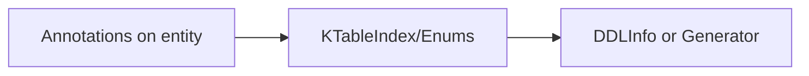

# Annotations & Index

- Annotations: @KronosInit, @Necessary, @TableIndex

Diagram:


What it does:
- Describe index/table metadata declaratively; replay via KPojo.kronosTableIndex().

Why this design:
- Lightweight declaration; decouple description from execution.

Example (pseudo):
```
@TableIndex(name = "idx_user_name", columns = ["name"]) 
class User(...)
```
