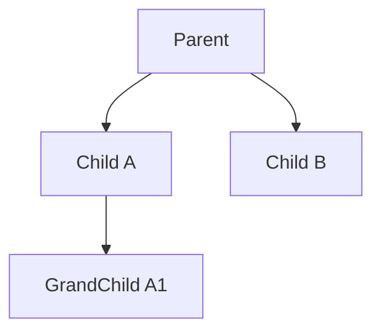

# Cascade Operations

- Related types:
  - `com.kotlinorm.orm.cascade.CascadeInsertClause`
  - `com.kotlinorm.orm.cascade.NodeOfKPojo`

Diagram:


What it does:
- Model parent-child dependencies as a tree/graph (foreign keys);
- Execution sorts nodes topologically, executes in dependency order and back-fills FKs when needed;
- Supports batches and multi-level operations;
- Not limited to insert: the structure can guide cascade Update/Delete as well (execution chooses action).

Why this design:
- Graph modeling makes dependency explicit for complex writes;
- Centralize ordering/back-fill/transactions at the execution layer; core stays dialect-agnostic;
- Plays well with plugins (e.g., lastInsertId backfill).

Example (pseudo Kotlin):
```
val cascade = CascadeInsertClause(
  root = NodeOfKPojo(
    value = Order(id=null, userId=1),
    children = listOf(
      NodeOfKPojo(value = OrderItem(id=null, orderId=null, sku="A")),
      NodeOfKPojo(value = OrderItem(id=null, orderId=null, sku="B"))
    )
  )
)
// Exec: insert Order -> fetch id -> fill into OrderItem.orderId -> batch insert items
```
