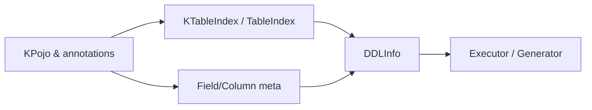

# DDL Modeling & Table Index

- DDLInfo: `com.kotlinorm.orm.ddl.DDLInfo`
- KTableIndex / @TableIndex

Diagram:


What it does:
- Describe schema & index requirements in a structured way.

Why this design:
- Core focuses on description; execution may be done by wrappers or generators.

Example:
```
val idx = KTableIndex(name = "idx_user_name", columns = arrayOf("name"), method = "btree")
```
