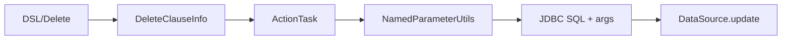

# Delete Clause

- Core model: `com.kotlinorm.orm.delete.DeleteClauseInfo` (implements KActionInfo)

Diagram:


What it does:
- Express delete target and where clause; supports logical vs physical deletion by wrapper/policy.

Why this design:
- Keep logical/physical delete choice in execution layer to stay DB-agnostic.

Example (Patch-based):
```kotlin
val (sql, paramMap) = user.delete().logic(false).by { it.id }.build()
// Logical delete: user.delete().where { it.id.eq }.build() -> UPDATE ... SET deleted=1
```
