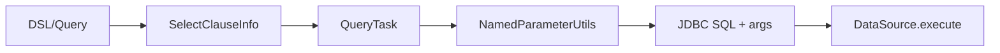

# Select Clause

- Core model: `com.kotlinorm.orm.select.SelectClauseInfo`

Diagram:


What it does:
- Carries SELECT semantics: table, fields, filters, group/order/having, pagination, lock.
- Works with functions/aliases; final dialect SQL is built by the execution layer.

Why this design:
- Decouple compile-time/DSL from runtime execution; keep a stable semantic model.
- Keep dialect differences (pagination/locks) in wrappers, not in the model.

Example (Patch-based, not direct new):
```kotlin
val (sql, paramMap) = User(2).select { it.id + it.username }
  .where { it.id < 10 }
  .page(1, 10)
  .build()
// Also available: .single() / .limit(n) / .withTotal().build()
```

Cascade:
- Compose multiple joins/sub-queries for cascaded reads; assembly/mapping happens in execution/mapping layers; core carries semantics only.
