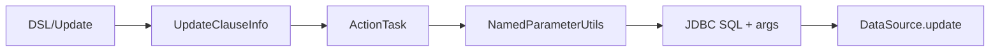

# Update Clause

- Core model: `com.kotlinorm.orm.update.UpdateClauseInfo` (implements KActionInfo)

Diagram:


What it does:
- Express target table, where clause, and source entity to build SET and args.
- Cooperates with common strategies (updateTime/logicDelete/optimisticLock).

Why this design:
- Keep complex SET/conditions in execution + strategies; model carries context.

Example (Patch-based):
```kotlin
val (sql, paramMap) = user.update { it.username + it.gender }
  .by { it.id }
  .build()
```
