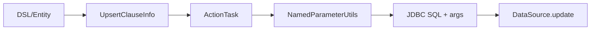

# Upsert Clause

- Core type: `com.kotlinorm.orm.upsert.UpsertClause` (implements KActionInfo via internal actionInfo)

Diagram:


What it does:
- Express "insert if not exists, otherwise update"; actual SQL is dialect-specific (MySQL ON DUPLICATE KEY, Postgres ON CONFLICT, SQLServer MERGE, etc.).
- Support specifying update fields when conflict occurs (setUpdateFields).

Why this design:
- One semantic model for upsert; avoid manually crafting dialect SQL.
- Let the execution layer choose the best implementation per dbType.

Example (Patch-based, not direct new):
```kotlin
val user = User(1)
user.upsert { it.username }.on { it.id }.execute()
// or: user.upsert().onConflict().execute()
```

Cascade:
- Upsert can participate in cascaded writes as well; execution orders parents/children and backfills FKs when necessary.
- Works with LastInsertIdPlugin and common strategies to keep audit fields consistent.
