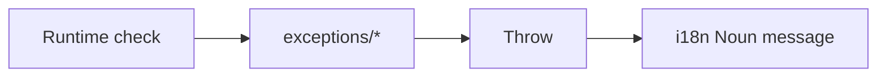

# Exceptions & i18n

Diagram:


What it does:
- Define and throw common exceptions (NoDataSourceException, InvalidParameterException, etc.)
- Provide message literals via i18n Noun.

Why this design:
- Decouple error type and message; internationalization-friendly.

Example:
```
if (dataSource == null) throw NoDataSourceException(Noun.noDataSourceMessage)
```
