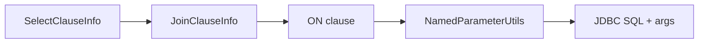

# Join

- Core model: `com.kotlinorm.orm.join.JoinClauseInfo`

Diagram:


What it does:
- Describe table joins (INNER/LEFT/RIGHT), aliases and ON predicate.
- Chain multiple joins to form complex queries.

Why this design:
- Keep Join as a reusable unit produced at DSL/compile-time; runtime only carries it.

Example (Patch-based):
```kotlin
val (sql, paramMap) = User(1).join(
  Order(1)
) { user, order ->
  leftJoin(order) { user.id == order.userId }
  select { user.id + order.id }
  where { user.id == 1 }
}.build()
```
