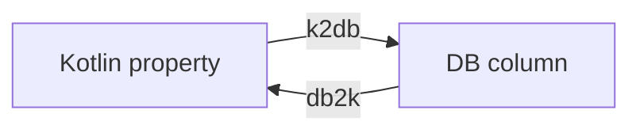

# Naming Strategy

- Interface: `com.kotlinorm.interfaces.KronosNamingStrategy`

Diagram:


What it does:
- Provide consistent name conversion at runtime and in generators.

Why this design:
- Abstract naming style as strategy for easy replacement and testing.

Example:
```
val ns: KronosNamingStrategy = NamingStrategies.LineHumpNamingStrategy
ns.k2db("createdAt") // created_at
ns.db2k("user_name") // userName
```
