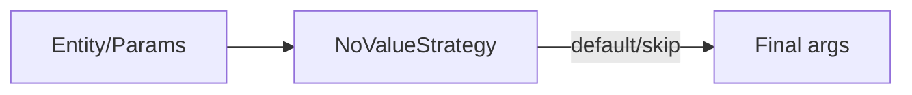

# NoValue Strategy

- Interface: `com.kotlinorm.interfaces.NoValueStrategy`

Diagram:


What it does:
- Decide how to handle null/empty/default during INSERT/UPDATE arg building.

Why this design:
- Centralize null-handling into a pluggable strategy; avoid scattered if-else.

Example:
```
val s = DefaultNoValueStrategy()
val v = s.resolve("updated_at", null)
```
