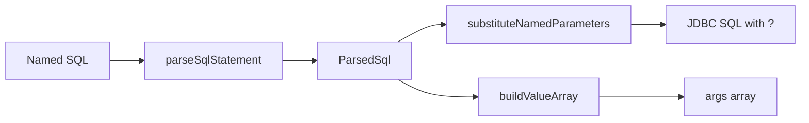

# Named Parameter SQL Parser

- Entry: `com.kotlinorm.beans.parser.NamedParameterUtils`

Diagram:


What it does:
- Parse named parameters like :name or :obj.prop, produce ParsedSql;
- Substitute named parameters with ?, and build ordered args;
- Handle quotes/comments/escapes; provide cache.

Why this design:
- Separate description (parse) and binding (substitute) for safety and reuse;
- Ignore string/comment/escape boundaries to avoid false matches;
- Cache to reduce repeated parsing cost.

Example:
```
val parsed = parseSqlStatement("select * from t where name=:name and id in (:ids)")
val sql = substituteNamedParameters(parsed, mapOf("name" to "a", "ids" to listOf(1,2)))
val args = buildValueArray(parsed, mapOf("name" to "a", "ids" to listOf(1,2)))
```
