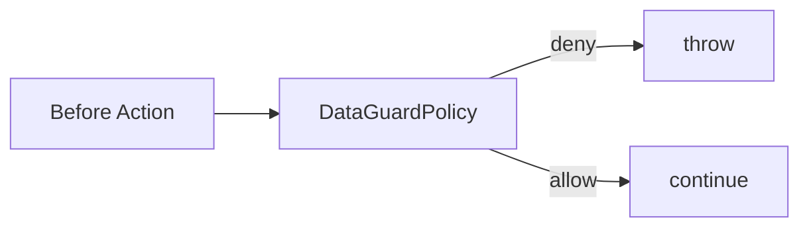

# Plugin: DataGuard

- Location: `com.kotlinorm.plugins.DataGuardPlugin`
- Capabilities:
  - Intercept dangerous operations in beforeAction:
    - DELETE/UPDATE without where (full table)
    - TRUNCATE/DROP/ALTER
  - Whitelist/blacklist policies by database/table name (supports % wildcard)
  - Enable/disable globally; configure via builder API

Diagram:


Usage:
```kotlin
DataGuardPlugin.enable {
  deleteAll {
    denyAll()
    allow { databaseName = "%"; tableName = "safe_table" }
  }
  updateAll { allowAll() }
  truncate { deny { databaseName = "prod_%"; tableName = "%" } }
}

DataGuardPlugin.disable()
```

Notes:
- Database name comes from wrapper (SqlManager.getDBNameFrom).
- Only empty whereClause is treated as full-table UPDATE/DELETE.
- Works with DDL table ops (drop/truncate/alter) as well.
