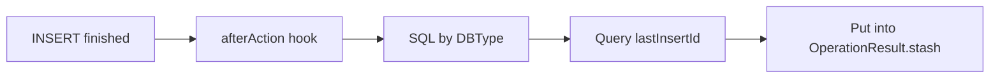

# Plugin: LastInsertId

- Location: `com.kotlinorm.plugins.LastInsertIdPlugin`

Diagram:

What it does:
- Hook after INSERT action; get lastInsertId depending on DB type;
- Expose as OperationResult.stash["lastInsertId"].

Why this design:
- Decouple PK retrieval from core execution; enable on demand;
- Extensible per DB type.

Usage:
- Set `LastInsertIdPlugin.enabled = true`, or call `withId()` on an InsertClause;
- Works only when `stash["useIdentity"] == true`.
