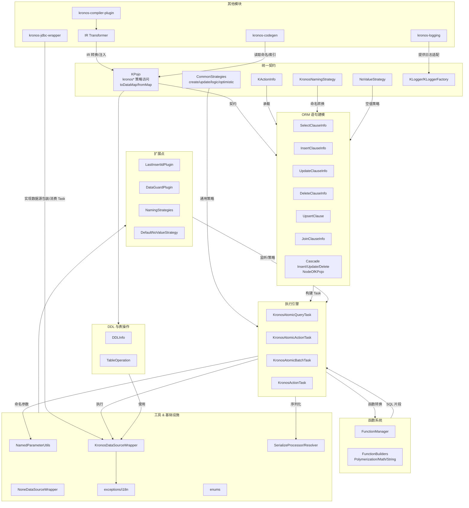
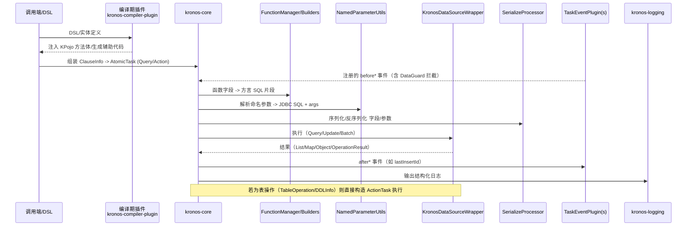

# 4. Mermaid 架构与流程图

组件关系图：

```mermaid
flowchart TD
  %% Contracts
  subgraph API[统一契约]
    A[KPojo <br/> kronos* 策略访问 <br/> toDataMap/fromMap]
    B[KActionInfo]
    C[KronosNamingStrategy]
    D[NoValueStrategy]
    CS[CommonStrategies<br/>create/update/logic/optimistic]
    L[KLogger/KLoggerFactory]
  end

  %% ORM Models
  subgraph ORM[ORM 语句建模]
    S[SelectClauseInfo]
    I[InsertClauseInfo]
    U[UpdateClauseInfo]
    D1[DeleteClauseInfo]
    UP[UpsertClause]
    J[JoinClauseInfo]
    C1[Cascade Insert/Update/Delete<br/>NodeOfKPojo]
  end

  %% Execution / Task Engine
  subgraph EXEC[执行引擎]
    QT[KronosAtomicQueryTask]
    AT[KronosAtomicActionTask]
    ABT[KronosAtomicBatchTask]
    KT[KronosActionTask]
  end

  %% Functions system
  subgraph FUNC[函数系统]
    FM[FunctionManager]
    FB[FunctionBuilders<br/>Polymerization/Math/String]
  end

  %% Tools & Infra
  subgraph Tools[工具 & 基础设施]
    NPU[NamedParameterUtils]
    KDW[KronosDataSourceWrapper]
    NDW[NoneDataSourceWrapper]
    SER[SerializeProcessor/Resolver]
    EX[exceptions/i18n]
    EN[enums]
  end

  %% DDL & Table Ops
  subgraph DDL[DDL 与表操作]
    DI[DDLInfo]
    TO[TableOperation]
  end

  %% Extensions: plugins & strategies impls
  subgraph Ext[扩展点]
    P[LastInsertIdPlugin]
    DG[DataGuardPlugin]
    NS[NamingStrategies]
    NV[DefaultNoValueStrategy]
  end

  %% Relations
  A -->|契约| ORM
  B -->|承载| ORM
  C -->|命名转换| ORM
  D -->|空值策略| ORM
  CS -->|通用策略| EXEC

  ORM -->|构建 Task| EXEC
  EXEC -->|命名参数| NPU
  EXEC -->|函数转换| FUNC
  EXEC -->|序列化| SER
  FUNC -->|SQL 片段| EXEC
  EXEC -->|执行| KDW

  KDW --> EX
  Tools --> Ext
  Ext -->|监听/策略| EXEC

  %% DDL
  A --> DDL
  DDL -->|使用| KDW

  %% Other modules
  subgraph Other[其他模块]
    CP[kronos-compiler-plugin]
    TR[IR Transformer]
    JW[kronos-jdbc-wrapper]
    CG[kronos-codegen]
    LOG[kronos-logging]
  end

  CP --> TR
  TR -->|IR 转换/注入| A
  JW -->|实现数据源包装/消费 Task| KDW
  CG -->|读取命名/索引| A
  LOG -->|提供日志适配| L
```

端到端执行流程：

```mermaid
sequenceDiagram
  participant DSL as 调用端/DSL
  participant KCP as 编译期插件<br/>kronos-compiler-plugin
  participant CORE as kronos-core
  participant FUNC as FunctionManager/Builders
  participant NP as NamedParameterUtils
  participant DS as KronosDataSourceWrapper
  participant SER as SerializeProcessor
  participant P as TaskEventPlugin(s)
  participant LOG as kronos-logging

  DSL->>KCP: DSL/实体定义
  KCP-->>DSL: 注入 KPojo 方法体/生成辅助代码
  DSL->>CORE: 组装 ClauseInfo -> AtomicTask (Query/Action)
  P-->>CORE: 注册的 before* 事件（含 DataGuard 拦截）
  CORE->>FUNC: 函数字段 -> 方言 SQL 片段
  CORE->>NP: 解析命名参数 -> JDBC SQL + args
  CORE->>SER: 序列化/反序列化 字段/参数
  CORE->>DS: 执行（Query/Update/Batch）
  DS-->>CORE: 结果（List/Map/Object/OperationResult）
  CORE->>P: after* 事件（如 lastInsertId）
  CORE->>LOG: 输出结构化日志

  Note over CORE,DS: 若为表操作（TableOperation/DDLInfo）则直接构造 ActionTask 执行
```
