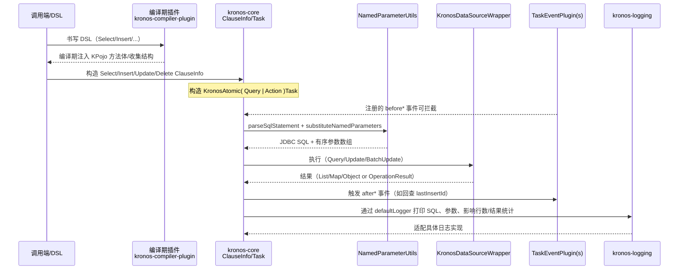

# 运行时执行流

本节给出从 DSL 到数据库的“SQL 生成与执行全流程”，覆盖 transformer、Action/Query、命名参数、插件与日志。

时序（简化）：

关键节点说明：
- Transformer（编译期）
  - 由 kronos-compiler-plugin 在 IR 阶段改写/注入 KPojo 等方法体，便于运行时调用；
- ClauseInfo -> Task
  - ClauseInfo 仅是数据载体；Task 负责串起命名参数解析、数据源执行、插件与日志；
- NamedParameterUtils
  - 将命名参数 SQL 安全地转为 JDBC `?` 占位与参数数组；
- KronosDataSourceWrapper
  - 统一 forList/forMap/forObject/update/batchUpdate/transact 接口；
- TaskEventPlugin
  - 支持四种钩子：before/after Query/Action；
- Logging
  - 通过 KLogger/KLoggerFactory 与 kronos-logging 适配器输出彩色/结构化日志。
