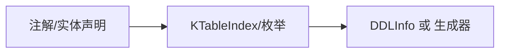

# 注解与索引

- 注解：
  - `@KronosInit`：用于回放初始化（编译器插件收集/回放使用）。
  - `@Necessary`：标注必要属性（参见源码）。
  - `@TableIndex`：声明表索引元数据。

简图：


主要功能：
- 用注解与结构体描述索引/表结构信息，便于统一生成或迁移；
- 运行时通过 KPojo.kronosTableIndex() 回放索引定义；
- 与 DDL 建模/命名策略协作，保持一致性。

为什么这样设计：
- 通过注解提供轻量描述，降低样板代码；
- 将“描述”与“执行”解耦，便于跨环境使用（生成代码/迁移工具/直接执行）。

使用示例（伪代码）：
```
@TableIndex(name = "idx_user_name", columns = ["name"]) 
class User(...)
```

约定：
- KPojo 的 `kronosTableIndex()` 返回 `MutableList<KTableIndex>`；
- 由编译器插件或 DSL 构造并回放到运行时。
