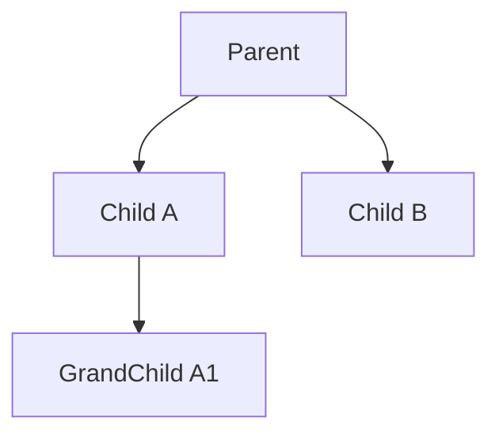

# 级联操作

- 相关类型：
  - `com.kotlinorm.orm.cascade.CascadeInsertClause`
  - `com.kotlinorm.orm.cascade.NodeOfKPojo`

简图：


主要功能：
- 使用树形结构描述父子实体及其依赖（外键）关系；
- 执行层对节点进行拓扑排序，按依赖顺序执行 INSERT，并在必要时回填外键；
- 支持批量子节点与不同层级的插入；
- 不仅支持插入场景，也可用于描述“级联更新/删除”的依赖顺序（由执行层选择对应动作）。

为什么这样设计：
- 将复杂的关系写入（插入/更新/删除）建模为图结构，清晰表达依赖；
- 由执行层集中处理“顺序/回填/事务”，核心保持与方言无关；
- 便于与插件（如 lastInsertId 回填）协作。

使用示例（伪代码）：
```kotlin
// 以插入为例，其他动作（更新/删除）同样可按依赖顺序执行
val cascade = CascadeInsertClause(
  root = NodeOfKPojo(
    value = Order(id=null, userId=1),
    children = listOf(
      NodeOfKPojo(value = OrderItem(id=null, orderId=null, sku="A")),
      NodeOfKPojo(value = OrderItem(id=null, orderId=null, sku="B"))
    )
  )
)
// 执行层：先插入 Order，获取 id -> 回填到 OrderItem.orderId，再批量插入子节点
```
