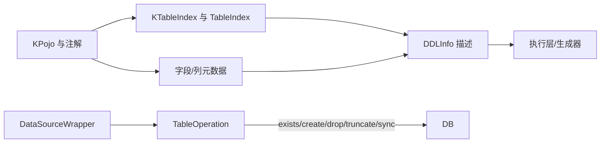

# DDL 建模与表索引 + 表操作

- DDLInfo：`com.kotlinorm.orm.ddl.DDLInfo`（参见源码），用于描述表/列的 DDL 需求；
- KTableIndex/KTableIndexEnum 与 @TableIndex 注解配合描述索引；
- 表操作入口（基于 Patch）：`KronosDataSourceWrapper.table` -> TableOperation

简图：


主要功能：
- 用结构化信息描述表结构与索引需求，便于统一生成或迁移；
- 提供统一表管理 API：exists、createTable、dropTable、truncateTable、syncTable；
- 支持索引差异与列差异同步（syncTable）。

为什么这样设计：
- 将 DDL 与执行解耦：core 仅给出“描述”，不同环境/方言选择不同执行器；
- 兼容生成器与迁移工具：同一描述可被 codegen、迁移脚本消费；
- 避免在业务代码中硬编码 DDL 字符串。

使用示例（基于 Patch 的表操作）：
```kotlin
val ds = obtainKronosDataSourceWrapper() // 获取数据源包装
// 是否存在
val exists = ds.table.exists<User>()
// 创建表
if (!exists) ds.table.createTable<User>()
// 同步表（已存在则进行列/索引差异同步）
ds.table.syncTable<User>()
// 截断表
ds.table.truncateTable<User>(restartIdentity = true)
// 删除表
ds.table.dropTable("user", "order")
```

索引声明示例：
```kotlin
val idx = KTableIndex(
  name = "idx_user_name",
  columns = arrayOf("name"),
  method = "btree"
)
```

设计原则：
- DDL 信息侧重描述，不直接耦合执行；
- 真正执行 DDL 的逻辑由执行层/工具层实现（例如 codegen 生成、或专用迁移工具）。
