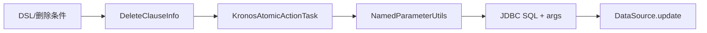

# Delete 子句

- 核心数据结构：`com.kotlinorm.orm.delete.DeleteClauseInfo`（参见源码）
- 实现 `KActionInfo`：承载 kClass/tableName/whereClause

简图：


主要功能：
- 表达删除的目标表与条件；
- 支持逻辑删除与物理删除两种策略（由执行层选择）。

为什么这样设计：
- 将“如何删除”（逻辑/物理）的策略放到执行层或配置，核心保持中立；
- 与通用策略（kronosLogicDelete）解耦，方便跨库一致化实现。

使用示例（基于 Patch 扩展，非直接 new）：
```kotlin
val (sql, paramMap) = user.delete().logic(false).by { it.id }.build()
// 逻辑删除：user.delete().where { it.id.eq }.build() -> UPDATE ... SET deleted=1
```

级联说明：
- 删除支持级联：可按父->子依赖顺序执行删除，执行层根据配置选择逻辑或物理删除；
- 建议在有外键约束的场景下，明确配置删除顺序或使用数据库级的 ON DELETE CASCADE。
