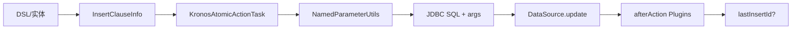

# Insert 子句

- 核心数据结构：`com.kotlinorm.orm.insert.InsertClauseInfo`
- 该结构实现 `KActionInfo`：
  - kClass: KClass<out KPojo>?
  - tableName: String
  - whereClause: String? （部分数据库支持 INSERT...ON DUPLICATE/WHERE 场景）

简图：


主要功能：
- 描述 INSERT 的目标表与来源实体类型（kClass），供执行层生成列/值；
- 通过 KActionInfo 统一承载与其他 DML 的公共信息；
- 与 TaskEventPlugin 协作支持插入后衍生动作（如回查 lastInsertId）。

为什么这样设计：
- 保持 ClauseInfo 纯粹数据载体，插入后逻辑通过插件解耦；
- 兼容多数据库：自增主键、序列等差异由插件与 wrapper 处理；
- whereClause 兼容少数方言或 upsert 场景，留扩展空间。

配套能力：
- 插件：`com.kotlinorm.plugins.LastInsertIdPlugin`
  - 为 INSERT 操作在执行后自动查询 lastInsertId（依赖 DBType）；
  - `InsertClause.withId()` 可显式要求回查；
  - 仅支持自增主键时启用（useIdentity）。

使用示例（基于 Patch 扩展，非直接 new）：
```kotlin
// 实体 User : KPojo
val (sql, paramMap) = User(1).insert().build()
// 或：User(1).insert().withId() // 回查主键（实际执行需结合插件与数据源）
```

级联说明：
- 插入支持级联：当使用 CascadeInsertClause/NodeOfKPojo 描述父子关系时，执行层会按拓扑顺序插入并在必要时回填外键；
- 可与 LastInsertIdPlugin 协作实现父->子主键回填。

常见问题：
- 不同数据库 lastInsertId 查询语句不同，见 `LastInsertIdPlugin.lastInsertIdObtainSql` 实现。
