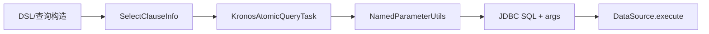

# Select 子句

- 核心数据结构：`com.kotlinorm.orm.select.SelectClauseInfo`
- 关键字段：
  - databaseName: String?
  - tableName: String
  - selectFields: List<Field>
  - distinct: Boolean
  - pagination: Boolean, pageIndex: Int, pageSize: Int
  - limit: Int?
  - lock: PessimisticLock?
  - whereClauseSql / groupByClauseSql / orderByClauseSql / havingClauseSql

简图：


主要功能：
- 承载 SELECT 语句的结构化信息（表、字段、过滤、分组、排序、分页、锁）；
- 与函数系统/别名等能力结合，生成最终方言 SQL 由执行层完成；
- 支持悲观锁标记，交由特定数据库方言处理。

为什么这样设计：
- 运行时与编译期解耦：核心只保存“语义数据”，方便编译期或 DSL 构造；
- 易于跨方言：分页、锁等差异交给执行层，ClauseInfo 保持稳定；
- 明确职责：SelectClauseInfo 只描述，不执行，不解析命名参数。

API 参考：
- beans.dsl.Field 表示选择列；
- enums.PessimisticLock 提供锁类型。

使用示例（基于 Patch 扩展，非直接 new）：
```kotlin
// 假设存在实体 User : KPojo
val (sql, paramMap) = User(2).select { it.id + it.username }
  .where { it.id < 10 }
  .page(1, 10)
  .build()
// 也可：.single() / .limit(n) / .withTotal().build()
```

级联说明：
- 选择查询可结合 Join/子查询对父子结构进行级联查询（由 DSL/编译期构建 Join，执行层负责 SQL 拼装与装载）；
- 对于树形结果的映射与装配，推荐在 DSL 层或装配层处理，core 仅承载语义信息。