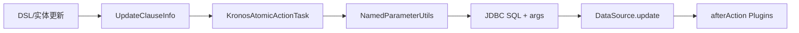

# Update 子句

- 核心数据结构：`com.kotlinorm.orm.update.UpdateClauseInfo`（参见源码）
- 实现 `KActionInfo`：承载 kClass/tableName/whereClause 等

简图：


主要功能：
- 表达 UPDATE 的目标表、条件与来源实体，交由执行层生成 set 子句与参数；
- 与通用策略协作：
  - create/update 时间自动填充（kronosCreateTime/kronosUpdateTime）；
  - 逻辑删除/乐观锁条件可合并到 whereClause；
- 支持批量 update by where 的场景。

为什么这样设计：
- ClauseInfo 只描述必要上下文，复杂 set/条件拼接交给执行层及策略；
- 乐观锁/逻辑删除作为通用策略解耦，便于跨库复用；
- 结合插件机制，在 afterAction 阶段可添加审计或补充信息。

使用示例（基于 Patch 扩展，非直接 new）：
```kotlin
val (sql, paramMap) = user.update { it.username + it.gender }
  .by { it.id }
  .build()
```

级联说明：
- 更新支持级联：当多个关联实体需要按依赖关系更新时，可结合树形描述（如 NodeOfKPojo）在执行层按顺序处理；
- 乐观锁/逻辑删除等策略会贯穿级联更新过程，由执行层统一应用。