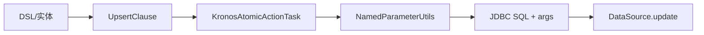

# Upsert 子句

- 核心类型：`com.kotlinorm.orm.upsert.UpsertClause`（参见源码）
- 实现 `KActionInfo`（通过内部 actionInfo 承载）：kClass/tableName/whereClause 等

简图：


主要功能：
- 表达“有则更新，无则插入”的语义，具体 SQL 由执行层按方言生成（如 MySQL ON DUPLICATE KEY、PG ON CONFLICT、SQLServer MERGE）；
- 支持指定当冲突发生时需要更新的字段集合（setUpdateFields）。

为什么这样设计：
- 用统一模型描述 Upsert 语义，避免在业务层拼接特定方言的语句；
- 由执行层根据 dbType 选择最佳实现。

使用示例（基于 Patch 扩展，非直接 new）：
```kotlin
val user = User(1)
user.upsert { it.username }.on { it.id }.execute()
// 也可以：user.upsert().onConflict().execute()
```

级联说明：
- Upsert 同样可以结合父子依赖进行级联写入，执行层将按依赖顺序决定是 insert 还是 update，并处理外键回填；
- 与 LastInsertIdPlugin/通用策略协作，保证审计字段与主键回填一致。