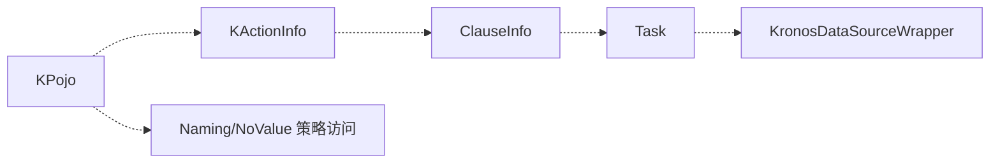

# 核心接口

简图：


主要功能：
- KPojo：实体契约，方法体由编译期插件注入；
- KActionInfo：DML 通用信息体；
- KronosNamingStrategy/NoValueStrategy：命名/空值策略；
- KronosDataSourceWrapper：统一执行层抽象。

为什么这样设计：
- 通过统一契约（接口）解耦编译期、运行时与执行层；
- 便于替换策略、兼容不同数据源实现。

使用示例（伪代码）：
```
val kclass = user.kClass()
val map = user.toDataMap()
val ds: KronosDataSourceWrapper = ...
```
