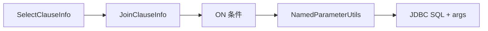

# Join 关联

- 核心数据结构：`com.kotlinorm.orm.join.JoinClauseInfo`

简图：


主要功能：
- 描述表关联（INNER/LEFT/RIGHT 等）以及 ON 条件表达式；
- 支持多表链式 join，承载别名/字段限定；
- 与函数/聚合/分组等配合，组成完整查询语义。

为什么这样设计：
- 将 Join 作为独立信息体便于组合与重用；
- 编译期或 DSL 构建 Join，运行时只做承载，降低耦合；
- 不同数据库方言的 join 细节差异交由执行层处理。

使用示例（伪代码）：
```kotlin
val join = JoinClauseInfo(
  leftTable = "user" to "u",
  rightTable = "order" to "o",
  joinType = JoinType.LEFT,
  onClauseSql = "u.id = o.user_id and o.created_at >= :from"
)
// 由执行层拼装 select ... from user u left join order o on ...
```

使用示例（基于 Patch 扩展）：
```kotlin
val (sql, paramMap) = User(1).join(
  Order(1)
) { user, order ->
  leftJoin(order) { user.id == order.userId }
  select { user.id + order.id }
  where { user.id == 1 }
}.build()
```

级联说明：
- 级联查询通常通过多次 join 或子查询实现，结果装配由执行层/装载层完成；

注意：
- Join 的生成通常发生在 DSL/编译期，core 仅承载；
- 执行层负责将 JoinClauseInfo 转换为对应 SQL。
