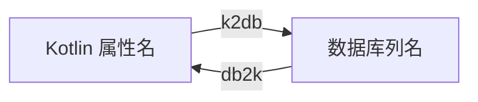

# 命名策略

- 接口：`com.kotlinorm.interfaces.KronosNamingStrategy`
  - db2k(name): String
  - k2db(name): String

- 默认实现：`com.kotlinorm.beans.config.NamingStrategies`
  - LineHumpNamingStrategy：驼峰 <-> 下划线
  - NoneNamingStrategy：不做转换

简图：


主要功能：
- 在运行时和生成阶段提供统一的名称转换；
- 避免硬编码大小写/下划线转换规则。

为什么这样设计：
- 将命名风格抽象为策略，便于替换和测试；
- 让核心模块对具体命名风格保持中立。

使用示例：
```kotlin
val ns: KronosNamingStrategy = NamingStrategies.LineHumpNamingStrategy
val column = ns.k2db("createdAt")  // created_at
val prop = ns.db2k("user_name")    // userName
```

扩展建议：
- 自定义类实现 KronosNamingStrategy，在配置或上下文中注入。
