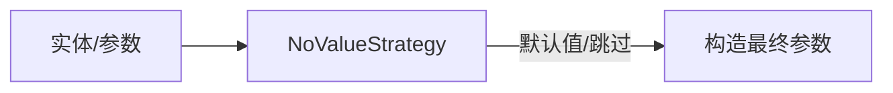

# 空值策略（NoValueStrategy）

- 接口：`com.kotlinorm.interfaces.NoValueStrategy`（参见源码与枚举 `NoValueStrategyType`）
- 默认实现：`com.kotlinorm.beans.config.DefaultNoValueStrategy`

简图：


主要功能：
- 在 INSERT/UPDATE 构造参数时，决定如何处理 null/空集合/默认值；
- 可根据不同数据库、字段类型给出默认值或跳过字段；
- 与执行层协作，统一参数构造行为。

为什么这样设计：
- 让“空值处理”从各处 SQL 拼接中抽离，集中策略化；
- 便于跨方言与类型扩展，避免散落判断。

使用示例（伪代码）：
```kotlin
val strategy = DefaultNoValueStrategy()
val value = strategy.resolve("updated_at", null) // 返回默认时间或跳过
```

扩展：
- 自定义策略并注入全局上下文即可生效。
