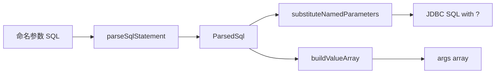

# 命名参数 SQL 解析

- 入口：`com.kotlinorm.beans.parser.NamedParameterUtils`

简图：


主要功能：
- 解析带 :name 或 :obj.prop 形式的命名参数 SQL；
- `parseSqlStatement` -> `ParsedSql`（含参数位置、数量等）；
- `substituteNamedParameters(parsed, paramSource)` 将命名参数替换为 `?` 占位；
- `buildValueArray(parsed, paramSource)` 按顺序构造实参数组；
- `getValueFromMap(map, path)` 支持点号路径取值；
- 忽略字符串、注释、转义等边界；
- 提供解析缓存（namedSqlCache）。

为什么这样设计：
- 以“描述与替换分离”的方式，提高安全性与复用度；
- 忽略字符串/注释/转义等边界，避免误识别；
- 通过缓存减少重复解析开销。

相关异常：
- `InvalidDataAccessApiUsageException`、`InvalidParameterException`。

使用示例：
```
val parsed = parseSqlStatement("select * from t where name=:name and id in (:ids)", mapOf())
val sql = substituteNamedParameters(parsed, mapOf("name" to "a", "ids" to listOf(1,2)))
val args = buildValueArray(parsed, mapOf("name" to "a", "ids" to listOf(1,2)))
```