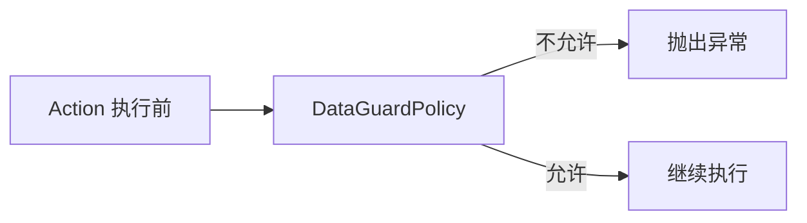

# 插件：DataGuard（数据防护插件）

- 位置：`com.kotlinorm.plugins.DataGuardPlugin`
- 能力：
  - 在 beforeAction 钩子拦截危险操作：
    - 无 where 的全表 DELETE/UPDATE；
    - TRUNCATE/DROP/ALTER；
  - 基于白名单/黑名单策略按库名/表名匹配放行；
  - 支持全局启用/关闭与 DSL 配置式启用。

简图：


使用：
```kotlin
// 全局启用并配置策略
DataGuardPlugin.enable {
  deleteAll {
    denyAll()
    allow { databaseName = "%"; tableName = "safe_table" }
  }
  updateAll { allowAll() /* 仅黑名单拦截 */ }
  truncate { deny { databaseName = "prod_%"; tableName = "%" } }
}

// 关闭
DataGuardPlugin.disable()
```

注意：
- 获取 dbName 依赖数据源 wrapper（SqlManager.getDBNameFrom）；
- whereClause 为空才视为全表 UPDATE/DELETE；
- 结合 DDL 表操作（drop/truncate/alter）时同样生效。