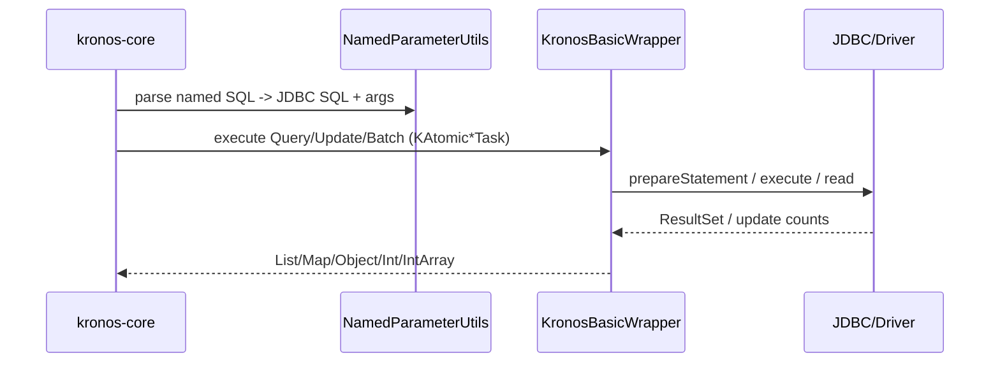

# Kronos JDBC Wrapper Developer Guide

This document introduces the kronos-jdbc-wrapper module, which provides a production-ready JDBC-based implementation of the KronosDataSourceWrapper contract used by kronos-core.

Who is this for:
- Users who want to execute Kronos tasks against JDBC data sources with minimal setup;
- Contributors who want to extend or adjust JDBC behaviors.

## 1. Module Overview
- Provides KronosBasicWrapper(DataSource) that implements KronosDataSourceWrapper.
- Bridges NamedParameter SQL generated by core tasks to JDBC PreparedStatement with correct parameter binding.
- Supports list/map/object/KPojo result extraction; batch updates; simple transaction helper.

Details:
- EN: [sections/en/01-overview.md](./sections/en/01-overview.md)
- 中文: [sections/zh_CN/01-模块定位与简介.md](./sections/zh_CN/01-模块定位与简介.md)

## 2. Layout and Key Classes
- com.kotlinorm.KronosBasicWrapper: the default JDBC wrapper.
- Depends on Kronos core contracts: KronosDataSourceWrapper, KAtomicQueryTask/KAtomicActionTask/KronosAtomicBatchTask.
- Leverages DBType detection from JDBC metadata to handle certain DB-specific branches (e.g., Oracle LONG columns, scrollable ResultSet options).

Details:
- EN: [sections/en/02-layout-and-key-classes.md](./sections/en/02-layout-and-key-classes.md)
- 中文: [sections/zh_CN/02-目录结构与关键类.md](./sections/zh_CN/02-目录结构与关键类.md)

## 3. Usage
- Wrap your javax.sql.DataSource (or any impl) with KronosBasicWrapper.
- Pass wrapper to Kronos DSL or operations that accept KronosDataSourceWrapper.
- Optionally leverage transaction helper transact { ... }.

Examples and more:
- EN: [sections/en/03-usage.md](./sections/en/03-usage.md)
- 中文: [sections/zh_CN/03-用法示例.md](./sections/zh_CN/03-用法示例.md)

## 4. Method Mapping (Contract)
- forList(task): List<Map<String, Any>>
- forList(task, kClass, isKPojo, superTypes): List<Any>
- forMap(task): Map<String, Any>?
- forObject(task, kClass, isKPojo, superTypes): Any?
- update(task): Int
- batchUpdate(task): IntArray
- transact(block): Any?

## 5. Mermaid: Execution Snapshot

## 6. Notes
- Oracle: wrapper employs scroll-insensitive read-only ResultSet and special handling for LONG columns to avoid stream-close issues.
- Collections/arrays in parameters are bound via JDBC Array; empty collections are treated as NULL for safety.
- KPojo mapping relies on cached column-to-field mapping from core; strictSetValue toggles typed getObject vs. type-safe conversion.
